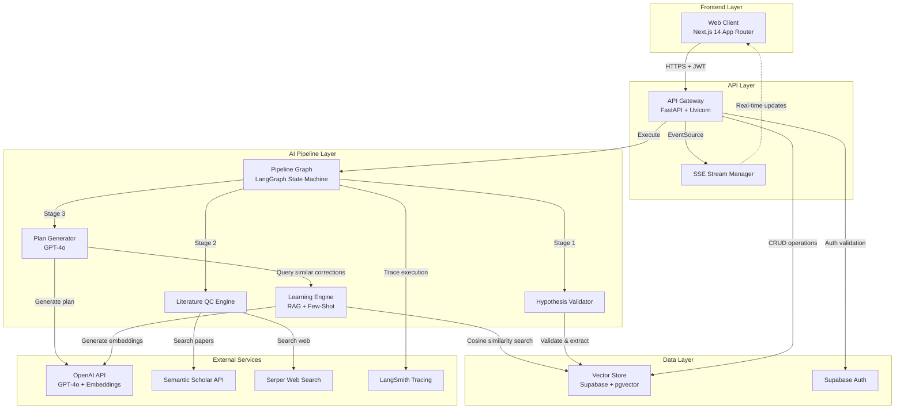
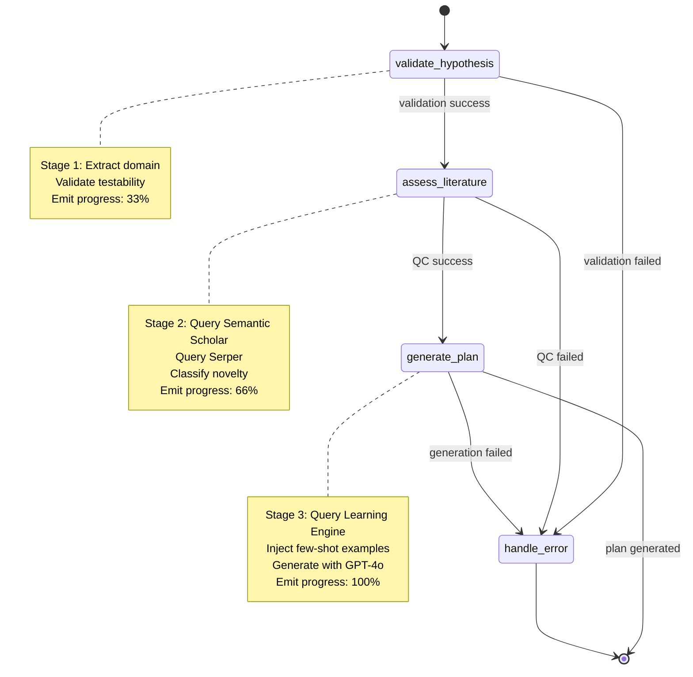

# Design Document: AI Scientist Platform

## Overview

The AI Scientist Platform is a production-grade, full-stack AI-powered experiment planning system that transforms natural-language scientific hypotheses into fully operational experiment plans. The system leverages GPT-4o for plan generation, LangGraph for stateful pipeline orchestration, Supabase for vector-based storage and retrieval, and implements a continuous learning loop through RAG-based feedback integration.

### Design Goals

1. **Production-Ready Quality**: Generate experiment plans that Principal Investigators trust enough to order materials and start experiments immediately
2. **Real-Time Transparency**: Provide live progress updates through Server-Sent Events streaming
3. **Continuous Improvement**: Learn from scientist corrections through vector-based similarity search and few-shot learning
4. **Maintainability**: Use explicit state machines (LangGraph) with deterministic transitions for debuggability
5. **Scalability**: Async-first architecture supporting 50+ concurrent requests
6. **Observability**: Full LangSmith tracing integration for pipeline monitoring and optimization

### Key Capabilities

- **Hypothesis Validation**: Extract domain information and validate testable claims
- **Literature Quality Control**: Assess novelty against Semantic Scholar and web sources within 30 seconds
- **Grounded Plan Generation**: Protocol steps from protocols.io/bio-protocol.org, real catalog numbers from Thermo Fisher/Sigma-Aldrich
- **Realistic Budgeting**: 2024-2025 supplier pricing with line-item breakdowns
- **Phased Timelines**: Explicit dependencies and Gantt-style visualization data
- **Validation Criteria**: Quantitative success/failure thresholds with measurement methods
- **Scientist Review Loop**: Rate and correct plans, with corrections embedded and injected as few-shot examples

## High-Level Architecture

### System Components



### Technology Stack

#### Frontend
- **Framework**: Next.js 14 (App Router, TypeScript)
- **Styling**: TailwindCSS + shadcn/ui components
- **State Management**: React hooks (useState, useEffect, useContext)
- **Real-Time**: EventSource API for SSE
- **Deployment**: Vercel

#### Backend
- **Framework**: FastAPI (Python 3.12+)
- **Server**: Uvicorn (ASGI)
- **Async Runtime**: asyncio with httpx for HTTP clients
- **Deployment**: Render.com

#### AI Pipeline
- **Orchestration**: LangGraph (stateful directed graphs)
- **LLM**: OpenAI GPT-4o
- **Embeddings**: OpenAI text-embedding-3-small (1536 dimensions)
- **Observability**: LangSmith tracing

#### Data Layer
- **Database**: Supabase (PostgreSQL)
- **Vector Search**: pgvector extension
- **Authentication**: Supabase Auth (JWT + OAuth)
- **Security**: Row Level Security (RLS) policies

### Data Flow

#### Plan Generation Flow
1. User submits hypothesis via Web Client
2. API Gateway validates JWT and establishes SSE stream
3. Pipeline Graph executes three stages sequentially:
   - **Stage 1 (Hypothesis Validator)**: Extract domain, validate testability → emit progress event
   - **Stage 2 (Literature QC Engine)**: Query Semantic Scholar + Serper, classify novelty → emit progress event
   - **Stage 3 (Plan Generator)**: Query Learning Engine for similar corrections, inject as few-shot examples, generate plan with GPT-4o → emit progress event
4. Complete plan stored in Vector Store with user_id
5. Final SSE event with complete plan sent to Web Client
6. LangSmith trace uploaded asynchronously

#### Review and Learning Flow
1. Scientist reviews plan sections (protocol, materials, budget, timeline, validation)
2. Ratings (1-5) and corrections submitted to API Gateway
3. Review stored in Vector Store with referential integrity to experiment_plan
4. Learning Engine generates embedding for correction text using OpenAI
5. Embedding stored in feedback_embeddings table with metadata (hypothesis_domain, scientist_id, timestamp)
6. pgvector index updated for similarity search (< 1 second)
7. Future plan generations query top-5 similar corrections (cosine similarity ≥ 0.75)

## Component Specifications

### 1. API Gateway (FastAPI)

**Responsibilities**:
- HTTP request handling and routing
- JWT authentication validation
- SSE stream management
- Pipeline orchestration
- Error handling and circuit breakers
- Rate limiting (10 req/min per user for plan generation)

**Key Endpoints**:

```python
# Plan Generation
POST /api/v1/plans/generate
  - Body: { hypothesis: str, user_id: str }
  - Returns: SSE stream (text/event-stream)
  - Auth: Required (JWT)
  - Rate Limit: 10/min per user

# Plan Retrieval
GET /api/v1/plans/{plan_id}
  - Returns: { plan: ExperimentPlan, metadata: dict }
  - Auth: Required (JWT + RLS)

# Review Submission
POST /api/v1/plans/{plan_id}/reviews
  - Body: { ratings: dict, corrections: dict }
  - Returns: { review_id: str, timestamp: datetime }
  - Auth: Required (JWT)

# Health Check
GET /health
  - Returns: { status: str, dependencies: dict }
  - Auth: Not required
```

**Async Architecture**:
- All route handlers use `async def`
- Async database client: `supabase-py` with async support
- Async HTTP clients: `httpx.AsyncClient` for external APIs
- Concurrent API calls: `asyncio.gather()` for independent operations
- Target: 50+ concurrent requests without degradation

**Error Handling**:
- Structured error responses: `{ error_code: str, message: str, details: dict }`
- Circuit breaker pattern: 3 consecutive failures → open state (30s cooldown)
- Exponential backoff: External API retries with max 3 attempts
- HTTP 503 with `Retry-After` header when Vector Store unavailable
- All errors logged to LangSmith with full context

**SSE Stream Format**:
```json
{
  "event": "progress",
  "data": {
    "stage": "hypothesis_validation",
    "status": "complete",
    "completion_percentage": 33,
    "message": "Hypothesis validated: Diagnostics domain detected",
    "timestamp": "2024-01-15T10:30:00Z"
  }
}
```

### 2. Hypothesis Validator

**Responsibilities**:
- Accept text input up to 5000 characters
- Extract scientific domain using GPT-4o
- Validate presence of testable claim
- Generate clarification questions for ambiguous hypotheses
- Return structured validation results

**Implementation**:

```python
class HypothesisValidator:
    def __init__(self, openai_client):
        self.client = openai_client
        self.domain_taxonomy = [
            "diagnostics", "gut_health", "cell_biology", 
            "climate_science", "materials_science", "neuroscience",
            # ... 14 more domains (20 total)
        ]
    
    async def validate(self, hypothesis: str) -> ValidationResult:
        """
        Validate hypothesis and extract domain.
        
        Returns:
            ValidationResult with fields:
            - is_valid: bool
            - domain: str | None
            - testable_claim: str | None
            - clarification_questions: list[str]
            - error_message: str | None
        """
        # Step 1: Length validation
        if len(hypothesis) > 5000:
            return ValidationResult(
                is_valid=False,
                error_message="Hypothesis exceeds 5000 character limit"
            )
        
        # Step 2: Extract domain and validate testability
        prompt = f"""
        Analyze this scientific hypothesis:
        
        "{hypothesis}"
        
        Tasks:
        1. Identify the scientific domain from: {self.domain_taxonomy}
        2. Extract the testable claim (must be falsifiable)
        3. If ambiguous, generate 2-3 clarification questions
        
        Return JSON:
        {{
          "domain": "domain_name",
          "testable_claim": "extracted claim",
          "is_testable": true/false,
          "clarification_questions": ["q1", "q2"],
          "reasoning": "explanation"
        }}
        """
        
        response = await self.client.chat.completions.create(
            model="gpt-4o",
            messages=[{"role": "user", "content": prompt}],
            response_format={"type": "json_object"},
            temperature=0.3
        )
        
        result = json.loads(response.choices[0].message.content)
        
        return ValidationResult(
            is_valid=result["is_testable"],
            domain=result["domain"],
            testable_claim=result["testable_claim"],
            clarification_questions=result["clarification_questions"],
            reasoning=result["reasoning"]
        )
```

**Domain Taxonomy** (20 domains):
- diagnostics, gut_health, cell_biology, climate_science, materials_science
- neuroscience, immunology, microbiology, genetics, biochemistry
- pharmacology, toxicology, ecology, bioinformatics, synthetic_biology
- tissue_engineering, regenerative_medicine, cancer_biology, virology, structural_biology

### 3. Literature QC Engine

**Responsibilities**:
- Query Semantic Scholar API for relevant papers
- Query Serper Web Search API for additional sources
- Classify novelty: `not_found`, `similar_exists`, `exact_match`
- Return citations with DOI and publication year
- Complete within 30 seconds
- Implement exponential backoff (max 3 retries) for rate limits

**Implementation**:

```python
class LiteratureQCEngine:
    def __init__(self, semantic_scholar_key: str, serper_key: str):
        self.ss_client = httpx.AsyncClient(
            base_url="https://api.semanticscholar.org/graph/v1",
            headers={"x-api-key": semantic_scholar_key},
            timeout=15.0
        )
        self.serper_client = httpx.AsyncClient(
            base_url="https://google.serper.dev",
            headers={"X-API-KEY": serper_key},
            timeout=15.0
        )
        self.max_retries = 3
    
    async def assess_novelty(
        self, 
        hypothesis: str, 
        domain: str
    ) -> NoveltyAssessment:
        """
        Assess hypothesis novelty against literature.
        
        Returns:
            NoveltyAssessment with fields:
            - classification: "not_found" | "similar_exists" | "exact_match"
            - similar_papers: list[Paper]
            - search_duration: float
        """
        start_time = time.time()
        
        # Concurrent searches with timeout
        try:
            async with asyncio.timeout(30):
                ss_results, serper_results = await asyncio.gather(
                    self._search_semantic_scholar(hypothesis, domain),
                    self._search_serper(hypothesis, domain),
                    return_exceptions=True
                )
        except asyncio.TimeoutError:
            return NoveltyAssessment(
                classification="not_found",
                similar_papers=[],
                search_duration=30.0,
                error="Search timeout exceeded"
            )
        
        # Combine and deduplicate results
        all_papers = self._merge_results(ss_results, serper_results)
        
        # Classify novelty using GPT-4o
        classification = await self._classify_novelty(
            hypothesis, 
            all_papers
        )
        
        duration = time.time() - start_time
        
        return NoveltyAssessment(
            classification=classification,
            similar_papers=all_papers[:10],  # Top 10
            search_duration=duration
        )
    
    async def _search_semantic_scholar(
        self, 
        hypothesis: str, 
        domain: str
    ) -> list[Paper]:
        """Search Semantic Scholar with exponential backoff."""
        for attempt in range(self.max_retries):
            try:
                response = await self.ss_client.get(
                    "/paper/search",
                    params={
                        "query": hypothesis,
                        "fields": "title,abstract,year,authors,citationCount,externalIds",
                        "limit": 20
                    }
                )
                response.raise_for_status()
                data = response.json()
                
                return [
                    Paper(
                        title=p["title"],
                        doi=p["externalIds"].get("DOI"),
                        year=p["year"],
                        citation_count=p["citationCount"],
                        abstract=p.get("abstract", "")
                    )
                    for p in data.get("data", [])
                ]
            
            except httpx.HTTPStatusError as e:
                if e.response.status_code == 429:  # Rate limit
                    wait_time = 2 ** attempt  # Exponential backoff
                    await asyncio.sleep(wait_time)
                else:
                    raise
        
        return []  # Failed after retries
    
    async def _classify_novelty(
        self, 
        hypothesis: str, 
        papers: list[Paper]
    ) -> str:
        """Use GPT-4o to classify novelty."""
        if not papers:
            return "not_found"
        
        papers_summary = "\n".join([
            f"- {p.title} ({p.year}): {p.abstract[:200]}..."
            for p in papers[:5]
        ])
        
        prompt = f"""
        Hypothesis: "{hypothesis}"
        
        Similar papers found:
        {papers_summary}
        
        Classify novelty:
        - "exact_match": Hypothesis already tested in literature
        - "similar_exists": Similar research exists but hypothesis is novel
        - "not_found": No similar research found
        
        Return JSON: {{"classification": "...", "reasoning": "..."}}
        """
        
        response = await self.openai_client.chat.completions.create(
            model="gpt-4o",
            messages=[{"role": "user", "content": prompt}],
            response_format={"type": "json_object"},
            temperature=0.2
        )
        
        result = json.loads(response.choices[0].message.content)
        return result["classification"]
```

### 4. Plan Generator

**Responsibilities**:
- Generate structured experiment plans using GPT-4o
- Ground protocol steps in protocols.io, bio-protocol.org, or peer-reviewed publications
- Include real catalog numbers from Thermo Fisher Scientific, Sigma-Aldrich
- Provide 2024-2025 supplier pricing with line-item breakdown
- Create phased timeline with explicit dependencies
- Define quantitative success/failure validation criteria
- Inject few-shot examples from Learning Engine (top-5 similar corrections, cosine similarity ≥ 0.75)

**Experiment Plan Schema**:

```typescript
interface ExperimentPlan {
  hypothesis: string;
  domain: string;
  novelty_classification: "not_found" | "similar_exists" | "exact_match";
  
  protocol: {
    steps: ProtocolStep[];
    references: Reference[];
    safety_considerations: string[];
    troubleshooting: TroubleshootingGuide[];
  };
  
  materials: {
    items: Material[];
    total_budget: number;
    currency: "USD";
  };
  
  timeline: {
    phases: Phase[];
    total_duration_days: number;
    gantt_data: GanttVisualization;
  };
  
  validation_criteria: {
    success_criteria: Criterion[];
    failure_criteria: Criterion[];
    validation_methods: ValidationMethod[];
  };
  
  metadata: {
    generated_at: string;
    model_version: "gpt-4o";
    few_shot_examples_used: number;
    requires_expert_review: string[];  // Flagged sections
  };
}

interface ProtocolStep {
  step_number: number;
  description: string;
  duration: string;  // e.g., "2 hours"
  critical_parameters: {
    temperature?: string;
    concentration?: string;
    ph?: string;
    [key: string]: string;
  };
  source: Reference;
}

interface Material {
  name: string;
  catalog_number: string;
  supplier: "Thermo Fisher" | "Sigma-Aldrich" | "Other";
  quantity: number;
  unit: string;
  unit_price: number;
  total_price: number;
  product_url: string;
  verification_status: "verified" | "pending_verification";
  alternatives?: Material[];
}

interface Phase {
  phase_number: number;
  name: string;
  duration_days: number;
  start_date: string;  // ISO 8601
  end_date: string;
  dependencies: number[];  // Phase numbers
  description: string;
}

interface Criterion {
  description: string;
  threshold: string;  // e.g., "p < 0.05", "> 80% viability"
  measurement_technique: string;
  expected_range: string;
  literature_precedent?: Reference;
}
```

**Implementation**:

```python
class PlanGenerator:
    def __init__(
        self, 
        openai_client, 
        learning_engine: LearningEngine
    ):
        self.client = openai_client
        self.learning_engine = learning_engine
        self.system_prompt = self._load_system_prompt()
    
    async def generate_plan(
        self,
        hypothesis: str,
        domain: str,
        novelty_assessment: NoveltyAssessment
    ) -> ExperimentPlan:
        """
        Generate complete experiment plan with few-shot learning.
        """
        # Query Learning Engine for similar corrections
        similar_corrections = await self.learning_engine.query_corrections(
            hypothesis=hypothesis,
            domain=domain,
            top_k=5,
            similarity_threshold=0.75
        )
        
        # Build few-shot examples
        few_shot_context = self._build_few_shot_context(similar_corrections)
        
        # Construct prompt
        user_prompt = f"""
        Generate a complete experiment plan for:
        
        Hypothesis: "{hypothesis}"
        Domain: {domain}
        Novelty: {novelty_assessment.classification}
        Similar Papers: {len(novelty_assessment.similar_papers)}
        
        Requirements:
        1. Protocol steps grounded in protocols.io, bio-protocol.org, or peer-reviewed sources
        2. Real catalog numbers from Thermo Fisher Scientific or Sigma-Aldrich
        3. 2024-2025 pricing (verify current supplier catalogs)
        4. Phased timeline with explicit dependencies
        5. Quantitative success/failure criteria
        6. Safety considerations for hazardous materials
        7. Troubleshooting guidance for common failure modes
        
        {few_shot_context}
        
        Return JSON matching ExperimentPlan schema.
        """
        
        response = await self.client.chat.completions.create(
            model="gpt-4o",
            messages=[
                {"role": "system", "content": self.system_prompt},
                {"role": "user", "content": user_prompt}
            ],
            response_format={"type": "json_object"},
            temperature=0.4,
            max_tokens=4000
        )
        
        plan_json = json.loads(response.choices[0].message.content)
        
        # Validate and parse
        plan = ExperimentPlan.parse_obj(plan_json)
        
        # Flag sections requiring expert review
        plan.metadata.requires_expert_review = self._identify_review_flags(plan)
        plan.metadata.few_shot_examples_used = len(similar_corrections)
        
        return plan
    
    def _build_few_shot_context(
        self, 
        corrections: list[FeedbackEmbedding]
    ) -> str:
        """Build few-shot examples from past corrections."""
        if not corrections:
            return ""
        
        examples = []
        for i, correction in enumerate(corrections, 1):
            examples.append(f"""
            Example {i} (Similarity: {correction.similarity:.2f}):
            Original Issue: {correction.original_issue}
            Correction: {correction.correction_text}
            Scientist Rating: {correction.rating}/5
            """)
        
        return f"""
        Past Corrections (learn from these):
        {"".join(examples)}
        
        Apply these learnings to avoid similar issues.
        """
    
    def _identify_review_flags(self, plan: ExperimentPlan) -> list[str]:
        """Identify sections requiring expert review."""
        flags = []
        
        # Check for unverified catalog numbers
        unverified = [
            m.name for m in plan.materials.items 
            if m.verification_status == "pending_verification"
        ]
        if unverified:
            flags.append(f"Materials: {len(unverified)} items pending verification")
        
        # Check for missing critical parameters
        missing_params = [
            s.step_number for s in plan.protocol.steps
            if not s.critical_parameters
        ]
        if missing_params:
            flags.append(f"Protocol: Steps {missing_params} missing critical parameters")
        
        # Check for vague validation criteria
        vague_criteria = [
            c.description for c in plan.validation_criteria.success_criteria
            if not c.threshold or "TBD" in c.threshold
        ]
        if vague_criteria:
            flags.append(f"Validation: {len(vague_criteria)} criteria need refinement")
        
        return flags
```

### 5. Learning Engine (RAG + Few-Shot)

**Responsibilities**:
- Generate embeddings for scientist corrections using OpenAI text-embedding-3-small
- Store embeddings in Vector Store with metadata
- Query similar corrections using cosine similarity (threshold ≥ 0.75)
- Return top-5 most relevant corrections for few-shot injection
- Track improvement metrics (plan ratings before/after few-shot)

**Implementation**:

```python
class LearningEngine:
    def __init__(
        self, 
        openai_client, 
        supabase_client
    ):
        self.openai_client = openai_client
        self.supabase = supabase_client
        self.embedding_model = "text-embedding-3-small"
        self.embedding_dimensions = 1536
        self.max_retries = 2
    
    async def embed_correction(
        self,
        correction_text: str,
        hypothesis_domain: str,
        scientist_id: str,
        plan_id: str,
        rating: int
    ) -> str:
        """
        Generate embedding for correction and store in Vector Store.
        
        Returns:
            embedding_id: str
        """
        # Generate embedding with retry logic
        embedding_vector = await self._generate_embedding_with_retry(
            correction_text
        )
        
        # Verify dimensionality
        assert len(embedding_vector) == self.embedding_dimensions, \
            f"Expected {self.embedding_dimensions} dimensions, got {len(embedding_vector)}"
        
        # Store in Vector Store
        result = await self.supabase.table("feedback_embeddings").insert({
            "correction_text": correction_text,
            "embedding": embedding_vector,
            "hypothesis_domain": hypothesis_domain,
            "scientist_id": scientist_id,
            "plan_id": plan_id,
            "rating": rating,
            "created_at": datetime.utcnow().isoformat()
        }).execute()
        
        return result.data[0]["id"]
    
    async def query_corrections(
        self,
        hypothesis: str,
        domain: str,
        top_k: int = 5,
        similarity_threshold: float = 0.75
    ) -> list[FeedbackEmbedding]:
        """
        Query similar corrections using cosine similarity.
        
        Returns:
            List of FeedbackEmbedding objects sorted by similarity (descending)
        """
        # Generate query embedding
        query_vector = await self._generate_embedding_with_retry(
            f"{domain}: {hypothesis}"
        )
        
        # Perform similarity search using pgvector
        # Uses cosine distance operator: <=>
        result = await self.supabase.rpc(
            "match_feedback_embeddings",
            {
                "query_embedding": query_vector,
                "match_threshold": 1 - similarity_threshold,  # Convert to distance
                "match_count": top_k,
                "filter_domain": domain
            }
        ).execute()
        
        # Parse results
        corrections = [
            FeedbackEmbedding(
                id=row["id"],
                correction_text=row["correction_text"],
                hypothesis_domain=row["hypothesis_domain"],
                similarity=1 - row["distance"],  # Convert back to similarity
                rating=row["rating"],
                created_at=row["created_at"]
            )
            for row in result.data
        ]
        
        return corrections
    
    async def _generate_embedding_with_retry(
        self, 
        text: str
    ) -> list[float]:
        """Generate embedding with exponential backoff retry."""
        for attempt in range(self.max_retries + 1):
            try:
                response = await self.openai_client.embeddings.create(
                    model=self.embedding_model,
                    input=text,
                    encoding_format="float"
                )
                return response.data[0].embedding
            
            except Exception as e:
                if attempt < self.max_retries:
                    wait_time = 2 ** attempt
                    await asyncio.sleep(wait_time)
                else:
                    raise Exception(
                        f"Embedding generation failed after {self.max_retries} retries: {e}"
                    )
```


## Database Design

### Schema Overview

The database uses Supabase (PostgreSQL) with pgvector extension for vector similarity search. All tables implement Row Level Security (RLS) policies based on user_id.

### Tables

#### 1. users
```sql
CREATE TABLE users (
  id UUID PRIMARY KEY DEFAULT gen_random_uuid(),
  email TEXT UNIQUE NOT NULL,
  full_name TEXT,
  institution TEXT,
  role TEXT CHECK (role IN ('principal_investigator', 'postdoc', 'grad_student', 'admin')),
  created_at TIMESTAMPTZ DEFAULT NOW(),
  updated_at TIMESTAMPTZ DEFAULT NOW()
);

-- RLS Policy
ALTER TABLE users ENABLE ROW LEVEL SECURITY;

CREATE POLICY "Users can view own profile"
  ON users FOR SELECT
  USING (auth.uid() = id);

CREATE POLICY "Users can update own profile"
  ON users FOR UPDATE
  USING (auth.uid() = id);
```

#### 2. hypotheses
```sql
CREATE TABLE hypotheses (
  id UUID PRIMARY KEY DEFAULT gen_random_uuid(),
  user_id UUID REFERENCES users(id) ON DELETE CASCADE,
  hypothesis_text TEXT NOT NULL CHECK (char_length(hypothesis_text) <= 5000),
  domain TEXT NOT NULL,
  testable_claim TEXT,
  validation_status TEXT CHECK (validation_status IN ('valid', 'invalid', 'needs_clarification')),
  clarification_questions JSONB,
  created_at TIMESTAMPTZ DEFAULT NOW()
);

-- Indexes
CREATE INDEX idx_hypotheses_user_id ON hypotheses(user_id);
CREATE INDEX idx_hypotheses_domain ON hypotheses(domain);
CREATE INDEX idx_hypotheses_created_at ON hypotheses(created_at DESC);

-- RLS Policy
ALTER TABLE hypotheses ENABLE ROW LEVEL SECURITY;

CREATE POLICY "Users can view own hypotheses"
  ON hypotheses FOR SELECT
  USING (auth.uid() = user_id);

CREATE POLICY "Users can insert own hypotheses"
  ON hypotheses FOR INSERT
  WITH CHECK (auth.uid() = user_id);
```

#### 3. experiment_plans
```sql
CREATE TABLE experiment_plans (
  id UUID PRIMARY KEY DEFAULT gen_random_uuid(),
  user_id UUID REFERENCES users(id) ON DELETE CASCADE,
  hypothesis_id UUID REFERENCES hypotheses(id) ON DELETE CASCADE,
  
  -- Plan content (JSONB for flexibility)
  plan_data JSONB NOT NULL,
  
  -- Metadata
  novelty_classification TEXT CHECK (novelty_classification IN ('not_found', 'similar_exists', 'exact_match')),
  model_version TEXT DEFAULT 'gpt-4o',
  few_shot_examples_used INTEGER DEFAULT 0,
  requires_expert_review TEXT[],
  
  -- Timestamps
  generated_at TIMESTAMPTZ DEFAULT NOW(),
  updated_at TIMESTAMPTZ DEFAULT NOW(),
  
  -- Status
  status TEXT CHECK (status IN ('draft', 'under_review', 'approved', 'in_progress', 'completed')) DEFAULT 'draft'
);

-- Indexes
CREATE INDEX idx_plans_user_id ON experiment_plans(user_id);
CREATE INDEX idx_plans_hypothesis_id ON experiment_plans(hypothesis_id);
CREATE INDEX idx_plans_status ON experiment_plans(status);
CREATE INDEX idx_plans_generated_at ON experiment_plans(generated_at DESC);

-- GIN index for JSONB queries
CREATE INDEX idx_plans_data_gin ON experiment_plans USING GIN (plan_data);

-- RLS Policy
ALTER TABLE experiment_plans ENABLE ROW LEVEL SECURITY;

CREATE POLICY "Users can view own plans"
  ON experiment_plans FOR SELECT
  USING (auth.uid() = user_id);

CREATE POLICY "Users can insert own plans"
  ON experiment_plans FOR INSERT
  WITH CHECK (auth.uid() = user_id);

CREATE POLICY "Users can update own plans"
  ON experiment_plans FOR UPDATE
  USING (auth.uid() = user_id);
```

#### 4. reviews
```sql
CREATE TABLE reviews (
  id UUID PRIMARY KEY DEFAULT gen_random_uuid(),
  plan_id UUID REFERENCES experiment_plans(id) ON DELETE CASCADE,
  user_id UUID REFERENCES users(id) ON DELETE CASCADE,
  
  -- Ratings (1-5 scale)
  protocol_rating INTEGER CHECK (protocol_rating BETWEEN 1 AND 5),
  materials_rating INTEGER CHECK (materials_rating BETWEEN 1 AND 5),
  budget_rating INTEGER CHECK (budget_rating BETWEEN 1 AND 5),
  timeline_rating INTEGER CHECK (timeline_rating BETWEEN 1 AND 5),
  validation_rating INTEGER CHECK (validation_rating BETWEEN 1 AND 5),
  overall_rating DECIMAL(3,2) GENERATED ALWAYS AS (
    (protocol_rating + materials_rating + budget_rating + timeline_rating + validation_rating) / 5.0
  ) STORED,
  
  -- Corrections (JSONB for structured feedback)
  corrections JSONB,
  
  -- Timestamps
  submitted_at TIMESTAMPTZ DEFAULT NOW(),
  
  -- Constraint: One review per user per plan
  UNIQUE(plan_id, user_id)
);

-- Indexes
CREATE INDEX idx_reviews_plan_id ON reviews(plan_id);
CREATE INDEX idx_reviews_user_id ON reviews(user_id);
CREATE INDEX idx_reviews_overall_rating ON reviews(overall_rating DESC);
CREATE INDEX idx_reviews_submitted_at ON reviews(submitted_at DESC);

-- RLS Policy
ALTER TABLE reviews ENABLE ROW LEVEL SECURITY;

CREATE POLICY "Users can view reviews of own plans"
  ON reviews FOR SELECT
  USING (
    EXISTS (
      SELECT 1 FROM experiment_plans
      WHERE experiment_plans.id = reviews.plan_id
      AND experiment_plans.user_id = auth.uid()
    )
    OR auth.uid() = user_id
  );

CREATE POLICY "Users can insert own reviews"
  ON reviews FOR INSERT
  WITH CHECK (auth.uid() = user_id);
```

#### 5. feedback_embeddings
```sql
-- Enable pgvector extension
CREATE EXTENSION IF NOT EXISTS vector;

CREATE TABLE feedback_embeddings (
  id UUID PRIMARY KEY DEFAULT gen_random_uuid(),
  review_id UUID REFERENCES reviews(id) ON DELETE CASCADE,
  plan_id UUID REFERENCES experiment_plans(id) ON DELETE CASCADE,
  scientist_id UUID REFERENCES users(id) ON DELETE CASCADE,
  
  -- Correction content
  correction_text TEXT NOT NULL,
  original_issue TEXT,
  
  -- Vector embedding (1536 dimensions for text-embedding-3-small)
  embedding vector(1536) NOT NULL,
  
  -- Metadata
  hypothesis_domain TEXT NOT NULL,
  rating INTEGER CHECK (rating BETWEEN 1 AND 5),
  
  -- Timestamps
  created_at TIMESTAMPTZ DEFAULT NOW()
);

-- Vector similarity index (HNSW for fast approximate nearest neighbor search)
CREATE INDEX idx_feedback_embeddings_vector 
  ON feedback_embeddings 
  USING hnsw (embedding vector_cosine_ops)
  WITH (m = 16, ef_construction = 64);

-- Regular indexes
CREATE INDEX idx_feedback_embeddings_domain ON feedback_embeddings(hypothesis_domain);
CREATE INDEX idx_feedback_embeddings_rating ON feedback_embeddings(rating DESC);
CREATE INDEX idx_feedback_embeddings_created_at ON feedback_embeddings(created_at DESC);

-- RLS Policy
ALTER TABLE feedback_embeddings ENABLE ROW LEVEL SECURITY;

CREATE POLICY "Users can view feedback embeddings"
  ON feedback_embeddings FOR SELECT
  USING (true);  -- Read-only for all authenticated users (for RAG)

CREATE POLICY "Users can insert own feedback embeddings"
  ON feedback_embeddings FOR INSERT
  WITH CHECK (auth.uid() = scientist_id);
```

### Database Functions

#### Similarity Search Function
```sql
CREATE OR REPLACE FUNCTION match_feedback_embeddings(
  query_embedding vector(1536),
  match_threshold float DEFAULT 0.25,  -- Cosine distance threshold (1 - 0.75 similarity)
  match_count int DEFAULT 5,
  filter_domain text DEFAULT NULL
)
RETURNS TABLE (
  id uuid,
  correction_text text,
  original_issue text,
  hypothesis_domain text,
  rating integer,
  created_at timestamptz,
  distance float
)
LANGUAGE plpgsql
AS $$
BEGIN
  RETURN QUERY
  SELECT
    feedback_embeddings.id,
    feedback_embeddings.correction_text,
    feedback_embeddings.original_issue,
    feedback_embeddings.hypothesis_domain,
    feedback_embeddings.rating,
    feedback_embeddings.created_at,
    (feedback_embeddings.embedding <=> query_embedding) AS distance
  FROM feedback_embeddings
  WHERE 
    (filter_domain IS NULL OR feedback_embeddings.hypothesis_domain = filter_domain)
    AND (feedback_embeddings.embedding <=> query_embedding) < match_threshold
  ORDER BY distance ASC
  LIMIT match_count;
END;
$$;
```

#### Average Rating Function
```sql
CREATE OR REPLACE FUNCTION get_average_plan_rating(plan_uuid uuid)
RETURNS decimal(3,2)
LANGUAGE plpgsql
AS $$
DECLARE
  avg_rating decimal(3,2);
BEGIN
  SELECT AVG(overall_rating) INTO avg_rating
  FROM reviews
  WHERE plan_id = plan_uuid;
  
  RETURN COALESCE(avg_rating, 0.0);
END;
$$;
```

### Migration Files

**Migration 001: Initial Schema**
```sql
-- File: migrations/001_initial_schema.sql

-- Enable extensions
CREATE EXTENSION IF NOT EXISTS "uuid-ossp";
CREATE EXTENSION IF NOT EXISTS vector;

-- Create tables (as defined above)
-- ... (all CREATE TABLE statements)

-- Create indexes
-- ... (all CREATE INDEX statements)

-- Enable RLS
-- ... (all RLS policies)

-- Create functions
-- ... (all CREATE FUNCTION statements)
```

**Migration 002: Sample Data (Development)**
```sql
-- File: migrations/002_sample_data.sql

-- Sample user
INSERT INTO users (id, email, full_name, institution, role)
VALUES (
  '00000000-0000-0000-0000-000000000001',
  'test@example.com',
  'Dr. Test Scientist',
  'MIT',
  'principal_investigator'
);

-- Sample hypothesis
INSERT INTO hypotheses (id, user_id, hypothesis_text, domain, testable_claim, validation_status)
VALUES (
  '00000000-0000-0000-0000-000000000002',
  '00000000-0000-0000-0000-000000000001',
  'Paper-based electrochemical biosensors can detect glucose at concentrations below 1 mM with 95% accuracy',
  'diagnostics',
  'Detection accuracy >= 95% at < 1 mM glucose',
  'valid'
);
```

**Rollback Migration**
```sql
-- File: migrations/rollback_001.sql

DROP FUNCTION IF EXISTS match_feedback_embeddings;
DROP FUNCTION IF EXISTS get_average_plan_rating;
DROP TABLE IF EXISTS feedback_embeddings CASCADE;
DROP TABLE IF EXISTS reviews CASCADE;
DROP TABLE IF EXISTS experiment_plans CASCADE;
DROP TABLE IF EXISTS hypotheses CASCADE;
DROP TABLE IF EXISTS users CASCADE;
DROP EXTENSION IF EXISTS vector;
```

## LangGraph Pipeline Design

### State Definition

```python
from typing import TypedDict, Literal
from langgraph.graph import StateGraph, END

class PipelineState(TypedDict):
    # Input
    hypothesis: str
    user_id: str
    
    # Stage 1: Hypothesis Validation
    validation_result: ValidationResult | None
    domain: str | None
    
    # Stage 2: Literature QC
    novelty_assessment: NoveltyAssessment | None
    
    # Stage 3: Plan Generation
    experiment_plan: ExperimentPlan | None
    
    # Error handling
    error: str | None
    current_stage: Literal["input", "validation", "literature_qc", "plan_generation", "complete", "error"]
    
    # Progress tracking
    progress_events: list[dict]
```

### Node Implementations

```python
class AIPipeline:
    def __init__(
        self,
        hypothesis_validator: HypothesisValidator,
        literature_qc_engine: LiteratureQCEngine,
        plan_generator: PlanGenerator,
        sse_manager: SSEManager
    ):
        self.validator = hypothesis_validator
        self.qc_engine = literature_qc_engine
        self.generator = plan_generator
        self.sse = sse_manager
        
        # Build graph
        self.graph = self._build_graph()
    
    def _build_graph(self) -> StateGraph:
        """Build LangGraph state machine with explicit transitions."""
        workflow = StateGraph(PipelineState)
        
        # Add nodes
        workflow.add_node("validate_hypothesis", self._validate_hypothesis_node)
        workflow.add_node("assess_literature", self._assess_literature_node)
        workflow.add_node("generate_plan", self._generate_plan_node)
        workflow.add_node("handle_error", self._handle_error_node)
        
        # Define edges (explicit transitions)
        workflow.set_entry_point("validate_hypothesis")
        
        # Conditional edge from validation
        workflow.add_conditional_edges(
            "validate_hypothesis",
            self._should_continue_after_validation,
            {
                "continue": "assess_literature",
                "error": "handle_error"
            }
        )
        
        # Conditional edge from literature QC
        workflow.add_conditional_edges(
            "assess_literature",
            self._should_continue_after_qc,
            {
                "continue": "generate_plan",
                "error": "handle_error"
            }
        )
        
        # Conditional edge from plan generation
        workflow.add_conditional_edges(
            "generate_plan",
            self._should_complete,
            {
                "complete": END,
                "error": "handle_error"
            }
        )
        
        # Error node always ends
        workflow.add_edge("handle_error", END)
        
        return workflow.compile()
    
    async def _validate_hypothesis_node(self, state: PipelineState) -> PipelineState:
        """Stage 1: Hypothesis Validation"""
        try:
            # Emit progress event
            await self.sse.emit_progress(
                stage="hypothesis_validation",
                status="in_progress",
                completion_percentage=10,
                message="Validating hypothesis and extracting domain..."
            )
            
            # Validate hypothesis
            validation_result = await self.validator.validate(state["hypothesis"])
            
            # Update state
            state["validation_result"] = validation_result
            state["domain"] = validation_result.domain
            state["current_stage"] = "validation"
            
            # Emit completion event
            await self.sse.emit_progress(
                stage="hypothesis_validation",
                status="complete",
                completion_percentage=33,
                message=f"Hypothesis validated: {validation_result.domain} domain detected"
            )
            
            return state
        
        except Exception as e:
            state["error"] = f"Validation failed: {str(e)}"
            state["current_stage"] = "error"
            return state
    
    async def _assess_literature_node(self, state: PipelineState) -> PipelineState:
        """Stage 2: Literature QC"""
        try:
            await self.sse.emit_progress(
                stage="literature_qc",
                status="in_progress",
                completion_percentage=40,
                message="Searching scientific literature..."
            )
            
            novelty_assessment = await self.qc_engine.assess_novelty(
                hypothesis=state["hypothesis"],
                domain=state["domain"]
            )
            
            state["novelty_assessment"] = novelty_assessment
            state["current_stage"] = "literature_qc"
            
            await self.sse.emit_progress(
                stage="literature_qc",
                status="complete",
                completion_percentage=66,
                message=f"Literature search complete: {novelty_assessment.classification}"
            )
            
            return state
        
        except Exception as e:
            state["error"] = f"Literature QC failed: {str(e)}"
            state["current_stage"] = "error"
            return state
    
    async def _generate_plan_node(self, state: PipelineState) -> PipelineState:
        """Stage 3: Plan Generation"""
        try:
            await self.sse.emit_progress(
                stage="plan_generation",
                status="in_progress",
                completion_percentage=70,
                message="Generating experiment plan with GPT-4o..."
            )
            
            experiment_plan = await self.generator.generate_plan(
                hypothesis=state["hypothesis"],
                domain=state["domain"],
                novelty_assessment=state["novelty_assessment"]
            )
            
            state["experiment_plan"] = experiment_plan
            state["current_stage"] = "complete"
            
            await self.sse.emit_progress(
                stage="plan_generation",
                status="complete",
                completion_percentage=100,
                message="Experiment plan generated successfully"
            )
            
            return state
        
        except Exception as e:
            state["error"] = f"Plan generation failed: {str(e)}"
            state["current_stage"] = "error"
            return state
    
    async def _handle_error_node(self, state: PipelineState) -> PipelineState:
        """Error handling node"""
        await self.sse.emit_error(
            stage=state["current_stage"],
            error_message=state["error"],
            diagnostic_info={
                "hypothesis": state["hypothesis"][:100],
                "domain": state.get("domain"),
                "stage": state["current_stage"]
            }
        )
        return state
    
    def _should_continue_after_validation(self, state: PipelineState) -> str:
        """Conditional edge: validation -> literature_qc or error"""
        if state.get("error"):
            return "error"
        if not state["validation_result"].is_valid:
            state["error"] = "Hypothesis validation failed"
            return "error"
        return "continue"
    
    def _should_continue_after_qc(self, state: PipelineState) -> str:
        """Conditional edge: literature_qc -> plan_generation or error"""
        if state.get("error"):
            return "error"
        return "continue"
    
    def _should_complete(self, state: PipelineState) -> str:
        """Conditional edge: plan_generation -> complete or error"""
        if state.get("error"):
            return "error"
        return "complete"
    
    async def execute(self, hypothesis: str, user_id: str) -> PipelineState:
        """Execute the pipeline with LangSmith tracing."""
        initial_state = PipelineState(
            hypothesis=hypothesis,
            user_id=user_id,
            validation_result=None,
            domain=None,
            novelty_assessment=None,
            experiment_plan=None,
            error=None,
            current_stage="input",
            progress_events=[]
        )
        
        # Execute graph with LangSmith tracing
        final_state = await self.graph.ainvoke(
            initial_state,
            config={
                "run_name": f"experiment_plan_{user_id}",
                "tags": ["experiment_planning", hypothesis[:50]],
                "metadata": {
                    "user_id": user_id,
                    "hypothesis_length": len(hypothesis)
                }
            }
        )
        
        return final_state
```

### LangSmith Integration

```python
import os
from langsmith import Client

# Configure LangSmith
os.environ["LANGCHAIN_TRACING_V2"] = "true"
os.environ["LANGCHAIN_ENDPOINT"] = "https://api.smith.langchain.com"
os.environ["LANGCHAIN_API_KEY"] = os.getenv("LANGSMITH_API_KEY")
os.environ["LANGCHAIN_PROJECT"] = "ai-scientist-platform"

# LangSmith client for custom logging
langsmith_client = Client()

async def log_pipeline_metrics(
    run_id: str,
    hypothesis_id: str,
    total_duration: float,
    stage_durations: dict[str, float],
    few_shot_examples_used: int
):
    """Log custom metrics to LangSmith."""
    langsmith_client.create_feedback(
        run_id=run_id,
        key="pipeline_metrics",
        score=1.0,
        value={
            "hypothesis_id": hypothesis_id,
            "total_duration_seconds": total_duration,
            "stage_durations": stage_durations,
            "few_shot_examples_used": few_shot_examples_used
        }
    )
```

### Graph Visualization




## Frontend Architecture

### Technology Stack

- **Framework**: Next.js 14 (App Router, TypeScript)
- **Styling**: TailwindCSS + shadcn/ui components
- **State Management**: React hooks (useState, useEffect, useContext)
- **Real-Time**: EventSource API for SSE
- **HTTP Client**: fetch API with TypeScript types
- **Deployment**: Vercel

### Component Hierarchy

```
app/
├── layout.tsx                    # Root layout with auth provider
├── page.tsx                      # Landing page
├── (auth)/
│   ├── login/
│   │   └── page.tsx             # Login page
│   └── signup/
│       └── page.tsx             # Signup page
├── (dashboard)/
│   ├── layout.tsx               # Dashboard layout with nav
│   ├── dashboard/
│   │   └── page.tsx             # Dashboard home
│   ├── new-plan/
│   │   └── page.tsx             # New plan creation
│   └── plans/
│       ├── page.tsx             # Plans list
│       └── [id]/
│           ├── page.tsx         # Plan detail view
│           └── review/
│               └── page.tsx     # Review interface
└── api/
    └── auth/
        └── [...nextauth]/
            └── route.ts         # NextAuth.js routes

components/
├── ui/                          # shadcn/ui components
│   ├── button.tsx
│   ├── card.tsx
│   ├── input.tsx
│   ├── progress.tsx
│   ├── tabs.tsx
│   └── ...
├── hypothesis-input.tsx         # Hypothesis input form
├── pipeline-progress.tsx        # Real-time progress display
├── experiment-plan-viewer.tsx   # Plan display with sections
├── review-panel.tsx             # Review and rating interface
├── material-list.tsx            # Materials table with catalog numbers
├── timeline-gantt.tsx           # Timeline visualization
└── sse-provider.tsx             # SSE connection manager

lib/
├── api-client.ts                # API client with types
├── sse-client.ts                # SSE connection utilities
├── types.ts                     # TypeScript interfaces
└── utils.ts                     # Utility functions
```

### Key Components

#### 1. Hypothesis Input Component

```typescript
// components/hypothesis-input.tsx
'use client';

import { useState } from 'react';
import { Button } from '@/components/ui/button';
import { Textarea } from '@/components/ui/textarea';
import { Card } from '@/components/ui/card';

interface HypothesisInputProps {
  onSubmit: (hypothesis: string) => void;
  isLoading: boolean;
}

export function HypothesisInput({ onSubmit, isLoading }: HypothesisInputProps) {
  const [hypothesis, setHypothesis] = useState('');
  const [charCount, setCharCount] = useState(0);
  const maxChars = 5000;

  const handleChange = (e: React.ChangeEvent<HTMLTextAreaElement>) => {
    const text = e.target.value;
    if (text.length <= maxChars) {
      setHypothesis(text);
      setCharCount(text.length);
    }
  };

  const handleSubmit = () => {
    if (hypothesis.trim().length > 0) {
      onSubmit(hypothesis);
    }
  };

  return (
    <Card className="p-6">
      <div className="space-y-4">
        <div>
          <label className="text-sm font-medium">Scientific Hypothesis</label>
          <Textarea
            value={hypothesis}
            onChange={handleChange}
            placeholder="Enter your scientific hypothesis (e.g., 'Paper-based electrochemical biosensors can detect glucose at concentrations below 1 mM with 95% accuracy')"
            className="mt-2 min-h-[200px]"
            disabled={isLoading}
          />
          <div className="mt-2 text-sm text-gray-500 text-right">
            {charCount} / {maxChars} characters
          </div>
        </div>
        
        <Button
          onClick={handleSubmit}
          disabled={isLoading || hypothesis.trim().length === 0}
          className="w-full"
        >
          {isLoading ? 'Generating Plan...' : 'Generate Experiment Plan'}
        </Button>
      </div>
    </Card>
  );
}
```

#### 2. Pipeline Progress Component

```typescript
// components/pipeline-progress.tsx
'use client';

import { useEffect, useState } from 'react';
import { Progress } from '@/components/ui/progress';
import { Card } from '@/components/ui/card';
import { CheckCircle, Circle, AlertCircle } from 'lucide-react';

interface ProgressEvent {
  stage: string;
  status: 'in_progress' | 'complete' | 'error';
  completion_percentage: number;
  message: string;
  timestamp: string;
}

interface PipelineProgressProps {
  events: ProgressEvent[];
}

const stages = [
  { id: 'hypothesis_validation', label: 'Hypothesis Validation' },
  { id: 'literature_qc', label: 'Literature Quality Control' },
  { id: 'plan_generation', label: 'Plan Generation' }
];

export function PipelineProgress({ events }: PipelineProgressProps) {
  const [currentStage, setCurrentStage] = useState<string | null>(null);
  const [overallProgress, setOverallProgress] = useState(0);

  useEffect(() => {
    if (events.length > 0) {
      const latestEvent = events[events.length - 1];
      setCurrentStage(latestEvent.stage);
      setOverallProgress(latestEvent.completion_percentage);
    }
  }, [events]);

  const getStageStatus = (stageId: string) => {
    const stageEvents = events.filter(e => e.stage === stageId);
    if (stageEvents.length === 0) return 'pending';
    const latestEvent = stageEvents[stageEvents.length - 1];
    return latestEvent.status;
  };

  return (
    <Card className="p-6">
      <div className="space-y-6">
        <div>
          <div className="flex justify-between mb-2">
            <span className="text-sm font-medium">Overall Progress</span>
            <span className="text-sm text-gray-500">{overallProgress}%</span>
          </div>
          <Progress value={overallProgress} className="h-2" />
        </div>

        <div className="space-y-4">
          {stages.map((stage, index) => {
            const status = getStageStatus(stage.id);
            const stageEvents = events.filter(e => e.stage === stage.id);
            const latestMessage = stageEvents.length > 0 
              ? stageEvents[stageEvents.length - 1].message 
              : '';

            return (
              <div key={stage.id} className="flex items-start space-x-3">
                <div className="mt-1">
                  {status === 'complete' && (
                    <CheckCircle className="w-5 h-5 text-green-500" />
                  )}
                  {status === 'in_progress' && (
                    <Circle className="w-5 h-5 text-blue-500 animate-pulse" />
                  )}
                  {status === 'error' && (
                    <AlertCircle className="w-5 h-5 text-red-500" />
                  )}
                  {status === 'pending' && (
                    <Circle className="w-5 h-5 text-gray-300" />
                  )}
                </div>
                <div className="flex-1">
                  <div className="font-medium">{stage.label}</div>
                  {latestMessage && (
                    <div className="text-sm text-gray-500 mt-1">
                      {latestMessage}
                    </div>
                  )}
                </div>
              </div>
            );
          })}
        </div>
      </div>
    </Card>
  );
}
```

#### 3. SSE Provider

```typescript
// components/sse-provider.tsx
'use client';

import { createContext, useContext, useCallback, useRef } from 'react';

interface SSEContextType {
  connect: (url: string, onMessage: (event: MessageEvent) => void) => void;
  disconnect: () => void;
}

const SSEContext = createContext<SSEContextType | null>(null);

export function SSEProvider({ children }: { children: React.ReactNode }) {
  const eventSourceRef = useRef<EventSource | null>(null);
  const reconnectTimeoutRef = useRef<NodeJS.Timeout | null>(null);
  const reconnectAttemptsRef = useRef(0);
  const maxReconnectAttempts = 5;

  const connect = useCallback((url: string, onMessage: (event: MessageEvent) => void) => {
    // Close existing connection
    if (eventSourceRef.current) {
      eventSourceRef.current.close();
    }

    // Create new EventSource
    const eventSource = new EventSource(url);
    eventSourceRef.current = eventSource;

    eventSource.onmessage = (event) => {
      reconnectAttemptsRef.current = 0; // Reset on successful message
      onMessage(event);
    };

    eventSource.onerror = (error) => {
      console.error('SSE error:', error);
      eventSource.close();

      // Exponential backoff reconnection
      if (reconnectAttemptsRef.current < maxReconnectAttempts) {
        const delay = Math.min(1000 * Math.pow(2, reconnectAttemptsRef.current), 30000);
        reconnectAttemptsRef.current++;

        reconnectTimeoutRef.current = setTimeout(() => {
          console.log(`Reconnecting... (attempt ${reconnectAttemptsRef.current})`);
          connect(url, onMessage);
        }, delay);
      }
    };

    eventSource.addEventListener('complete', (event) => {
      console.log('Pipeline complete');
      eventSource.close();
    });

    eventSource.addEventListener('error', (event) => {
      console.error('Pipeline error:', event);
      eventSource.close();
    });
  }, []);

  const disconnect = useCallback(() => {
    if (eventSourceRef.current) {
      eventSourceRef.current.close();
      eventSourceRef.current = null;
    }
    if (reconnectTimeoutRef.current) {
      clearTimeout(reconnectTimeoutRef.current);
      reconnectTimeoutRef.current = null;
    }
    reconnectAttemptsRef.current = 0;
  }, []);

  return (
    <SSEContext.Provider value={{ connect, disconnect }}>
      {children}
    </SSEContext.Provider>
  );
}

export function useSSE() {
  const context = useContext(SSEContext);
  if (!context) {
    throw new Error('useSSE must be used within SSEProvider');
  }
  return context;
}
```

#### 4. Experiment Plan Viewer

```typescript
// components/experiment-plan-viewer.tsx
'use client';

import { Tabs, TabsContent, TabsList, TabsTrigger } from '@/components/ui/tabs';
import { Card } from '@/components/ui/card';
import { Badge } from '@/components/ui/badge';
import { ExperimentPlan } from '@/lib/types';
import { MaterialList } from './material-list';
import { TimelineGantt } from './timeline-gantt';

interface ExperimentPlanViewerProps {
  plan: ExperimentPlan;
}

export function ExperimentPlanViewer({ plan }: ExperimentPlanViewerProps) {
  return (
    <div className="space-y-6">
      {/* Header */}
      <Card className="p-6">
        <div className="space-y-4">
          <div>
            <h2 className="text-2xl font-bold">Experiment Plan</h2>
            <p className="text-gray-500 mt-2">{plan.hypothesis}</p>
          </div>
          
          <div className="flex gap-2">
            <Badge variant="outline">{plan.domain}</Badge>
            <Badge variant="outline">{plan.novelty_classification}</Badge>
            {plan.metadata.few_shot_examples_used > 0 && (
              <Badge variant="secondary">
                {plan.metadata.few_shot_examples_used} corrections applied
              </Badge>
            )}
          </div>

          {plan.metadata.requires_expert_review.length > 0 && (
            <div className="bg-yellow-50 border border-yellow-200 rounded-lg p-4">
              <h3 className="font-medium text-yellow-900">Requires Expert Review</h3>
              <ul className="mt-2 space-y-1">
                {plan.metadata.requires_expert_review.map((flag, i) => (
                  <li key={i} className="text-sm text-yellow-800">• {flag}</li>
                ))}
              </ul>
            </div>
          )}
        </div>
      </Card>

      {/* Tabbed Content */}
      <Tabs defaultValue="protocol" className="w-full">
        <TabsList className="grid w-full grid-cols-5">
          <TabsTrigger value="protocol">Protocol</TabsTrigger>
          <TabsTrigger value="materials">Materials</TabsTrigger>
          <TabsTrigger value="budget">Budget</TabsTrigger>
          <TabsTrigger value="timeline">Timeline</TabsTrigger>
          <TabsTrigger value="validation">Validation</TabsTrigger>
        </TabsList>

        <TabsContent value="protocol">
          <Card className="p-6">
            <h3 className="text-lg font-semibold mb-4">Protocol Steps</h3>
            <div className="space-y-6">
              {plan.protocol.steps.map((step) => (
                <div key={step.step_number} className="border-l-2 border-blue-500 pl-4">
                  <div className="font-medium">
                    Step {step.step_number}: {step.description}
                  </div>
                  <div className="text-sm text-gray-500 mt-1">
                    Duration: {step.duration}
                  </div>
                  {Object.keys(step.critical_parameters).length > 0 && (
                    <div className="mt-2 bg-gray-50 rounded p-3">
                      <div className="text-sm font-medium">Critical Parameters:</div>
                      <ul className="mt-1 space-y-1">
                        {Object.entries(step.critical_parameters).map(([key, value]) => (
                          <li key={key} className="text-sm">
                            <span className="font-medium">{key}:</span> {value}
                          </li>
                        ))}
                      </ul>
                    </div>
                  )}
                  {step.source && (
                    <div className="mt-2 text-sm text-blue-600">
                      Source: {step.source.title}
                    </div>
                  )}
                </div>
              ))}
            </div>

            {plan.protocol.safety_considerations.length > 0 && (
              <div className="mt-6 bg-red-50 border border-red-200 rounded-lg p-4">
                <h4 className="font-medium text-red-900">Safety Considerations</h4>
                <ul className="mt-2 space-y-1">
                  {plan.protocol.safety_considerations.map((safety, i) => (
                    <li key={i} className="text-sm text-red-800">• {safety}</li>
                  ))}
                </ul>
              </div>
            )}
          </Card>
        </TabsContent>

        <TabsContent value="materials">
          <MaterialList materials={plan.materials.items} />
        </TabsContent>

        <TabsContent value="budget">
          <Card className="p-6">
            <h3 className="text-lg font-semibold mb-4">Budget Breakdown</h3>
            <div className="space-y-4">
              <table className="w-full">
                <thead>
                  <tr className="border-b">
                    <th className="text-left py-2">Item</th>
                    <th className="text-right py-2">Quantity</th>
                    <th className="text-right py-2">Unit Price</th>
                    <th className="text-right py-2">Total</th>
                  </tr>
                </thead>
                <tbody>
                  {plan.materials.items.map((item, i) => (
                    <tr key={i} className="border-b">
                      <td className="py-2">{item.name}</td>
                      <td className="text-right">{item.quantity} {item.unit}</td>
                      <td className="text-right">${item.unit_price.toFixed(2)}</td>
                      <td className="text-right">${item.total_price.toFixed(2)}</td>
                    </tr>
                  ))}
                </tbody>
                <tfoot>
                  <tr className="font-bold">
                    <td colSpan={3} className="text-right py-4">Total Budget:</td>
                    <td className="text-right py-4">
                      ${plan.materials.total_budget.toFixed(2)} {plan.materials.currency}
                    </td>
                  </tr>
                </tfoot>
              </table>
            </div>
          </Card>
        </TabsContent>

        <TabsContent value="timeline">
          <TimelineGantt phases={plan.timeline.phases} />
        </TabsContent>

        <TabsContent value="validation">
          <Card className="p-6">
            <div className="space-y-6">
              <div>
                <h3 className="text-lg font-semibold mb-4">Success Criteria</h3>
                <div className="space-y-3">
                  {plan.validation_criteria.success_criteria.map((criterion, i) => (
                    <div key={i} className="bg-green-50 border border-green-200 rounded-lg p-4">
                      <div className="font-medium text-green-900">{criterion.description}</div>
                      <div className="text-sm text-green-800 mt-2">
                        <span className="font-medium">Threshold:</span> {criterion.threshold}
                      </div>
                      <div className="text-sm text-green-800">
                        <span className="font-medium">Method:</span> {criterion.measurement_technique}
                      </div>
                      {criterion.expected_range && (
                        <div className="text-sm text-green-800">
                          <span className="font-medium">Expected Range:</span> {criterion.expected_range}
                        </div>
                      )}
                    </div>
                  ))}
                </div>
              </div>

              <div>
                <h3 className="text-lg font-semibold mb-4">Failure Criteria</h3>
                <div className="space-y-3">
                  {plan.validation_criteria.failure_criteria.map((criterion, i) => (
                    <div key={i} className="bg-red-50 border border-red-200 rounded-lg p-4">
                      <div className="font-medium text-red-900">{criterion.description}</div>
                      <div className="text-sm text-red-800 mt-2">
                        <span className="font-medium">Threshold:</span> {criterion.threshold}
                      </div>
                      <div className="text-sm text-red-800">
                        <span className="font-medium">Method:</span> {criterion.measurement_technique}
                      </div>
                    </div>
                  ))}
                </div>
              </div>
            </div>
          </Card>
        </TabsContent>
      </Tabs>
    </div>
  );
}
```

### State Management

```typescript
// lib/types.ts
export type PipelineState = 
  | 'idle'
  | 'validating'
  | 'searching'
  | 'generating'
  | 'complete'
  | 'error';

export interface AppState {
  pipelineState: PipelineState;
  currentPlan: ExperimentPlan | null;
  progressEvents: ProgressEvent[];
  error: string | null;
}

// app/(dashboard)/new-plan/page.tsx
'use client';

import { useState } from 'react';
import { useRouter } from 'next/navigation';
import { HypothesisInput } from '@/components/hypothesis-input';
import { PipelineProgress } from '@/components/pipeline-progress';
import { useSSE } from '@/components/sse-provider';
import { AppState, PipelineState, ProgressEvent } from '@/lib/types';

export default function NewPlanPage() {
  const router = useRouter();
  const { connect, disconnect } = useSSE();
  
  const [state, setState] = useState<AppState>({
    pipelineState: 'idle',
    currentPlan: null,
    progressEvents: [],
    error: null
  });

  const handleSubmit = async (hypothesis: string) => {
    setState(prev => ({
      ...prev,
      pipelineState: 'validating',
      progressEvents: [],
      error: null
    }));

    // Establish SSE connection
    const apiUrl = `${process.env.NEXT_PUBLIC_API_URL}/api/v1/plans/generate`;
    
    connect(apiUrl, (event) => {
      const data = JSON.parse(event.data);
      
      if (data.event === 'progress') {
        setState(prev => ({
          ...prev,
          progressEvents: [...prev.progressEvents, data.data],
          pipelineState: mapStageToPipelineState(data.data.stage)
        }));
      } else if (data.event === 'complete') {
        setState(prev => ({
          ...prev,
          pipelineState: 'complete',
          currentPlan: data.data.plan
        }));
        disconnect();
        
        // Navigate to plan detail page
        router.push(`/plans/${data.data.plan.id}`);
      } else if (data.event === 'error') {
        setState(prev => ({
          ...prev,
          pipelineState: 'error',
          error: data.data.error_message
        }));
        disconnect();
      }
    });

    // Send POST request to initiate pipeline
    try {
      const response = await fetch(apiUrl, {
        method: 'POST',
        headers: {
          'Content-Type': 'application/json',
          'Authorization': `Bearer ${getAuthToken()}`
        },
        body: JSON.stringify({ hypothesis })
      });

      if (!response.ok) {
        throw new Error('Failed to start pipeline');
      }
    } catch (error) {
      setState(prev => ({
        ...prev,
        pipelineState: 'error',
        error: error.message
      }));
      disconnect();
    }
  };

  return (
    <div className="container mx-auto py-8 max-w-4xl">
      <h1 className="text-3xl font-bold mb-8">Generate New Experiment Plan</h1>
      
      <div className="space-y-6">
        <HypothesisInput
          onSubmit={handleSubmit}
          isLoading={state.pipelineState !== 'idle' && state.pipelineState !== 'complete'}
        />

        {state.progressEvents.length > 0 && (
          <PipelineProgress events={state.progressEvents} />
        )}

        {state.error && (
          <div className="bg-red-50 border border-red-200 rounded-lg p-4">
            <h3 className="font-medium text-red-900">Error</h3>
            <p className="text-sm text-red-800 mt-1">{state.error}</p>
          </div>
        )}
      </div>
    </div>
  );
}

function mapStageToPipelineState(stage: string): PipelineState {
  switch (stage) {
    case 'hypothesis_validation':
      return 'validating';
    case 'literature_qc':
      return 'searching';
    case 'plan_generation':
      return 'generating';
    default:
      return 'idle';
  }
}
```


## API Design

### REST Endpoints

#### Authentication

All protected endpoints require JWT authentication via `Authorization: Bearer <token>` header.

#### Base URL
- **Development**: `http://localhost:8000`
- **Production**: `https://api.aiscientist.com`

### Endpoint Specifications

#### 1. Generate Experiment Plan (SSE Stream)

```
POST /api/v1/plans/generate
```

**Request**:
```json
{
  "hypothesis": "Paper-based electrochemical biosensors can detect glucose at concentrations below 1 mM with 95% accuracy",
  "user_id": "uuid"
}
```

**Response**: Server-Sent Events stream (`text/event-stream`)

**Event Types**:

1. **Progress Event**:
```json
{
  "event": "progress",
  "data": {
    "stage": "hypothesis_validation" | "literature_qc" | "plan_generation",
    "status": "in_progress" | "complete",
    "completion_percentage": 33,
    "message": "Hypothesis validated: Diagnostics domain detected",
    "timestamp": "2024-01-15T10:30:00Z"
  }
}
```

2. **Complete Event**:
```json
{
  "event": "complete",
  "data": {
    "plan_id": "uuid",
    "plan": { /* ExperimentPlan object */ }
  }
}
```

3. **Error Event**:
```json
{
  "event": "error",
  "data": {
    "error_code": "VALIDATION_FAILED",
    "error_message": "Hypothesis does not contain a testable claim",
    "diagnostic_info": {
      "hypothesis_length": 150,
      "domain": null
    }
  }
}
```

**Rate Limit**: 10 requests per minute per user

**Implementation**:

```python
from fastapi import FastAPI, Depends, HTTPException
from fastapi.responses import StreamingResponse
from sse_starlette.sse import EventSourceResponse
import asyncio

app = FastAPI()

@app.post("/api/v1/plans/generate")
async def generate_plan(
    request: GeneratePlanRequest,
    user: User = Depends(get_current_user)
):
    """Generate experiment plan with SSE streaming."""
    
    # Rate limiting check
    if not await rate_limiter.check_limit(user.id, "plan_generation"):
        raise HTTPException(
            status_code=429,
            detail="Rate limit exceeded",
            headers={"Retry-After": "60"}
        )
    
    async def event_generator():
        """Generate SSE events from pipeline execution."""
        try:
            # Create SSE manager for this request
            sse_manager = SSEManager()
            
            # Execute pipeline
            pipeline = AIPipeline(
                hypothesis_validator=hypothesis_validator,
                literature_qc_engine=literature_qc_engine,
                plan_generator=plan_generator,
                sse_manager=sse_manager
            )
            
            # Run pipeline in background task
            pipeline_task = asyncio.create_task(
                pipeline.execute(request.hypothesis, user.id)
            )
            
            # Stream events as they arrive
            async for event in sse_manager.event_stream():
                yield {
                    "event": event["type"],
                    "data": json.dumps(event["data"])
                }
            
            # Wait for pipeline completion
            final_state = await pipeline_task
            
            if final_state["error"]:
                yield {
                    "event": "error",
                    "data": json.dumps({
                        "error_code": "PIPELINE_ERROR",
                        "error_message": final_state["error"],
                        "diagnostic_info": {
                            "stage": final_state["current_stage"]
                        }
                    })
                }
            else:
                # Store plan in database
                plan_id = await store_experiment_plan(
                    user_id=user.id,
                    hypothesis_id=final_state["validation_result"].hypothesis_id,
                    plan_data=final_state["experiment_plan"]
                )
                
                yield {
                    "event": "complete",
                    "data": json.dumps({
                        "plan_id": str(plan_id),
                        "plan": final_state["experiment_plan"].dict()
                    })
                }
        
        except Exception as e:
            logger.error(f"Pipeline error: {e}", exc_info=True)
            yield {
                "event": "error",
                "data": json.dumps({
                    "error_code": "INTERNAL_ERROR",
                    "error_message": "An unexpected error occurred",
                    "diagnostic_info": {}
                })
            }
    
    return EventSourceResponse(event_generator())
```

#### 2. Get Experiment Plan

```
GET /api/v1/plans/{plan_id}
```

**Response**:
```json
{
  "id": "uuid",
  "user_id": "uuid",
  "hypothesis_id": "uuid",
  "plan_data": { /* ExperimentPlan object */ },
  "novelty_classification": "similar_exists",
  "model_version": "gpt-4o",
  "few_shot_examples_used": 3,
  "requires_expert_review": ["Materials: 2 items pending verification"],
  "status": "under_review",
  "generated_at": "2024-01-15T10:35:00Z",
  "average_rating": 4.2
}
```

**Errors**:
- `404`: Plan not found
- `403`: Unauthorized (not plan owner)

#### 3. List User Plans

```
GET /api/v1/plans?status=draft&limit=20&offset=0
```

**Query Parameters**:
- `status` (optional): Filter by status (`draft`, `under_review`, `approved`, `in_progress`, `completed`)
- `limit` (optional): Number of results (default: 20, max: 100)
- `offset` (optional): Pagination offset (default: 0)

**Response**:
```json
{
  "plans": [
    {
      "id": "uuid",
      "hypothesis": "...",
      "domain": "diagnostics",
      "status": "under_review",
      "generated_at": "2024-01-15T10:35:00Z",
      "average_rating": 4.2
    }
  ],
  "total": 45,
  "limit": 20,
  "offset": 0
}
```

#### 4. Submit Review

```
POST /api/v1/plans/{plan_id}/reviews
```

**Request**:
```json
{
  "ratings": {
    "protocol": 5,
    "materials": 4,
    "budget": 4,
    "timeline": 5,
    "validation": 4
  },
  "corrections": {
    "materials": {
      "original_issue": "Catalog number ABC123 not found",
      "correction": "Use catalog number XYZ789 from Thermo Fisher instead",
      "section": "materials",
      "item_index": 3
    },
    "protocol": {
      "original_issue": "Step 5 missing temperature specification",
      "correction": "Incubate at 37°C for 2 hours",
      "section": "protocol",
      "step_number": 5
    }
  }
}
```

**Response**:
```json
{
  "review_id": "uuid",
  "plan_id": "uuid",
  "overall_rating": 4.4,
  "submitted_at": "2024-01-15T11:00:00Z",
  "embeddings_generated": 2
}
```

**Implementation**:

```python
@app.post("/api/v1/plans/{plan_id}/reviews")
async def submit_review(
    plan_id: UUID,
    review: ReviewSubmission,
    user: User = Depends(get_current_user),
    db: AsyncSession = Depends(get_db)
):
    """Submit review and generate feedback embeddings."""
    
    # Verify plan exists and user has access
    plan = await db.get(ExperimentPlan, plan_id)
    if not plan:
        raise HTTPException(status_code=404, detail="Plan not found")
    
    # Store review
    db_review = Review(
        plan_id=plan_id,
        user_id=user.id,
        protocol_rating=review.ratings.protocol,
        materials_rating=review.ratings.materials,
        budget_rating=review.ratings.budget,
        timeline_rating=review.ratings.timeline,
        validation_rating=review.ratings.validation,
        corrections=review.corrections
    )
    db.add(db_review)
    await db.commit()
    await db.refresh(db_review)
    
    # Generate embeddings for corrections asynchronously
    embedding_tasks = []
    for section, correction in review.corrections.items():
        task = learning_engine.embed_correction(
            correction_text=correction["correction"],
            hypothesis_domain=plan.plan_data["domain"],
            scientist_id=user.id,
            plan_id=plan_id,
            rating=review.ratings[section]
        )
        embedding_tasks.append(task)
    
    embedding_ids = await asyncio.gather(*embedding_tasks)
    
    return {
        "review_id": str(db_review.id),
        "plan_id": str(plan_id),
        "overall_rating": db_review.overall_rating,
        "submitted_at": db_review.submitted_at.isoformat(),
        "embeddings_generated": len(embedding_ids)
    }
```

#### 5. Health Check

```
GET /health
```

**Response**:
```json
{
  "status": "healthy",
  "timestamp": "2024-01-15T10:00:00Z",
  "dependencies": {
    "database": {
      "status": "healthy",
      "latency_ms": 12
    },
    "openai": {
      "status": "healthy",
      "latency_ms": 245
    },
    "semantic_scholar": {
      "status": "healthy",
      "latency_ms": 156
    },
    "serper": {
      "status": "healthy",
      "latency_ms": 89
    }
  },
  "version": "1.0.0"
}
```

**Implementation**:

```python
@app.get("/health")
async def health_check():
    """Health check endpoint with dependency status."""
    
    async def check_database():
        try:
            start = time.time()
            await supabase.table("users").select("id").limit(1).execute()
            latency = (time.time() - start) * 1000
            return {"status": "healthy", "latency_ms": round(latency, 2)}
        except Exception as e:
            return {"status": "unhealthy", "error": str(e)}
    
    async def check_openai():
        try:
            start = time.time()
            await openai_client.models.list()
            latency = (time.time() - start) * 1000
            return {"status": "healthy", "latency_ms": round(latency, 2)}
        except Exception as e:
            return {"status": "unhealthy", "error": str(e)}
    
    # Check all dependencies concurrently
    db_status, openai_status, ss_status, serper_status = await asyncio.gather(
        check_database(),
        check_openai(),
        check_semantic_scholar(),
        check_serper(),
        return_exceptions=True
    )
    
    overall_status = "healthy" if all(
        s.get("status") == "healthy" 
        for s in [db_status, openai_status, ss_status, serper_status]
    ) else "degraded"
    
    return {
        "status": overall_status,
        "timestamp": datetime.utcnow().isoformat(),
        "dependencies": {
            "database": db_status,
            "openai": openai_status,
            "semantic_scholar": ss_status,
            "serper": serper_status
        },
        "version": "1.0.0"
    }
```

### Error Response Format

All error responses follow this structure:

```json
{
  "error_code": "VALIDATION_FAILED",
  "message": "Human-readable error message",
  "details": {
    "field": "hypothesis",
    "reason": "Exceeds maximum length of 5000 characters"
  },
  "timestamp": "2024-01-15T10:00:00Z",
  "request_id": "uuid"
}
```

### Rate Limiting

**Implementation**:

```python
from fastapi import Request
from slowapi import Limiter, _rate_limit_exceeded_handler
from slowapi.util import get_remote_address
from slowapi.errors import RateLimitExceeded

limiter = Limiter(key_func=get_remote_address)
app.state.limiter = limiter
app.add_exception_handler(RateLimitExceeded, _rate_limit_exceeded_handler)

@app.post("/api/v1/plans/generate")
@limiter.limit("10/minute")
async def generate_plan(request: Request, ...):
    ...
```

**Rate Limits**:
- Plan generation: 10 requests/minute per user
- Review submission: 30 requests/minute per user
- Plan retrieval: 100 requests/minute per user
- Health check: No limit

## Integration Points

### 1. OpenAI API

**Purpose**: LLM inference (GPT-4o) and embeddings (text-embedding-3-small)

**Configuration**:
```python
from openai import AsyncOpenAI

openai_client = AsyncOpenAI(
    api_key=os.getenv("OPENAI_API_KEY"),
    timeout=60.0,
    max_retries=2
)
```

**Usage**:
- **GPT-4o**: Hypothesis validation, novelty classification, plan generation
- **text-embedding-3-small**: Feedback correction embeddings (1536 dimensions)

**Rate Limits**:
- GPT-4o: 10,000 requests/day (Tier 1)
- Embeddings: 3,000,000 tokens/day

**Error Handling**:
```python
from openai import RateLimitError, APIError

try:
    response = await openai_client.chat.completions.create(...)
except RateLimitError:
    # Queue request for retry
    await request_queue.enqueue(request)
    raise HTTPException(status_code=429, detail="OpenAI rate limit exceeded")
except APIError as e:
    logger.error(f"OpenAI API error: {e}")
    raise HTTPException(status_code=503, detail="LLM service unavailable")
```

### 2. Semantic Scholar API

**Purpose**: Scientific literature search

**Configuration**:
```python
semantic_scholar_client = httpx.AsyncClient(
    base_url="https://api.semanticscholar.org/graph/v1",
    headers={"x-api-key": os.getenv("SEMANTIC_SCHOLAR_API_KEY")},
    timeout=15.0
)
```

**Endpoints Used**:
- `GET /paper/search`: Search papers by query
- `GET /paper/{paper_id}`: Get paper details

**Rate Limits**: 100 requests/5 minutes (free tier)

**Response Example**:
```json
{
  "data": [
    {
      "paperId": "abc123",
      "title": "Paper-based biosensors for glucose detection",
      "year": 2023,
      "authors": [...],
      "citationCount": 45,
      "externalIds": {
        "DOI": "10.1234/example"
      },
      "abstract": "..."
    }
  ]
}
```

### 3. Serper Web Search API

**Purpose**: Supplementary web search for scientific sources

**Configuration**:
```python
serper_client = httpx.AsyncClient(
    base_url="https://google.serper.dev",
    headers={"X-API-KEY": os.getenv("SERPER_API_KEY")},
    timeout=15.0
)
```

**Endpoint Used**:
- `POST /search`: Google search with custom parameters

**Request**:
```json
{
  "q": "paper-based electrochemical biosensors glucose detection",
  "num": 20,
  "gl": "us",
  "hl": "en"
}
```

**Rate Limits**: 2,500 searches/month (free tier)

### 4. LangSmith Tracing

**Purpose**: Observability and debugging for LangGraph pipelines

**Configuration**:
```python
import os

os.environ["LANGCHAIN_TRACING_V2"] = "true"
os.environ["LANGCHAIN_ENDPOINT"] = "https://api.smith.langchain.com"
os.environ["LANGCHAIN_API_KEY"] = os.getenv("LANGSMITH_API_KEY")
os.environ["LANGCHAIN_PROJECT"] = "ai-scientist-platform"
```

**Automatic Tracing**:
- All LangGraph executions automatically traced
- Includes: stage names, durations, input/output data, errors

**Custom Logging**:
```python
from langsmith import Client

langsmith_client = Client()

# Log custom metrics
langsmith_client.create_feedback(
    run_id=run_id,
    key="plan_quality",
    score=average_rating,
    value={
        "few_shot_examples_used": 3,
        "requires_expert_review": ["materials"],
        "total_duration_seconds": 87.5
    }
)
```

**Dashboard**: https://smith.langchain.com/

### 5. Supabase Auth

**Purpose**: User authentication and authorization

**Configuration**:
```python
from supabase import create_client, Client

supabase: Client = create_client(
    os.getenv("SUPABASE_URL"),
    os.getenv("SUPABASE_ANON_KEY")
)
```

**Authentication Flow**:
1. User signs up/logs in via Web Client
2. Supabase Auth returns JWT token
3. Web Client includes token in `Authorization` header
4. API Gateway validates token and extracts user_id
5. RLS policies enforce data access based on user_id

**JWT Validation**:
```python
from fastapi import Depends, HTTPException
from fastapi.security import HTTPBearer, HTTPAuthorizationCredentials
import jwt

security = HTTPBearer()

async def get_current_user(
    credentials: HTTPAuthorizationCredentials = Depends(security)
) -> User:
    """Validate JWT and return current user."""
    try:
        token = credentials.credentials
        payload = jwt.decode(
            token,
            os.getenv("SUPABASE_JWT_SECRET"),
            algorithms=["HS256"],
            audience="authenticated"
        )
        user_id = payload.get("sub")
        
        # Fetch user from database
        user = await db.get(User, user_id)
        if not user:
            raise HTTPException(status_code=401, detail="User not found")
        
        return user
    
    except jwt.ExpiredSignatureError:
        raise HTTPException(status_code=401, detail="Token expired")
    except jwt.InvalidTokenError:
        raise HTTPException(status_code=401, detail="Invalid token")
```

## Deployment Architecture

### Vercel (Frontend)

**Configuration**: `vercel.json`
```json
{
  "buildCommand": "npm run build",
  "outputDirectory": ".next",
  "framework": "nextjs",
  "env": {
    "NEXT_PUBLIC_API_URL": "@api-url",
    "NEXT_PUBLIC_SUPABASE_URL": "@supabase-url",
    "NEXT_PUBLIC_SUPABASE_ANON_KEY": "@supabase-anon-key"
  },
  "regions": ["iad1"],
  "functions": {
    "app/**/*.tsx": {
      "maxDuration": 10
    }
  }
}
```

**Environment Variables** (Vercel Dashboard):
- `NEXT_PUBLIC_API_URL`: https://api.aiscientist.com
- `NEXT_PUBLIC_SUPABASE_URL`: https://xxx.supabase.co
- `NEXT_PUBLIC_SUPABASE_ANON_KEY`: eyJhbGc...

**Build Command**: `npm run build`

**Deployment**:
```bash
# Install Vercel CLI
npm install -g vercel

# Deploy to production
vercel --prod
```

### Render.com (Backend)

**Configuration**: `render.yaml`
```yaml
services:
  - type: web
    name: ai-scientist-api
    env: python
    region: oregon
    plan: starter
    buildCommand: "pip install -r requirements.txt"
    startCommand: "uvicorn main:app --host 0.0.0.0 --port 8000"
    envVars:
      - key: PYTHON_VERSION
        value: 3.12.0
      - key: OPENAI_API_KEY
        sync: false
      - key: SEMANTIC_SCHOLAR_API_KEY
        sync: false
      - key: SERPER_API_KEY
        sync: false
      - key: LANGSMITH_API_KEY
        sync: false
      - key: SUPABASE_URL
        sync: false
      - key: SUPABASE_SERVICE_KEY
        sync: false
      - key: SUPABASE_JWT_SECRET
        sync: false
    healthCheckPath: /health
    autoDeploy: true
```

**Environment Variables** (Render Dashboard):
- `OPENAI_API_KEY`: sk-...
- `SEMANTIC_SCHOLAR_API_KEY`: ...
- `SERPER_API_KEY`: ...
- `LANGSMITH_API_KEY`: ...
- `SUPABASE_URL`: https://xxx.supabase.co
- `SUPABASE_SERVICE_KEY`: eyJhbGc...
- `SUPABASE_JWT_SECRET`: ...

**Deployment**:
```bash
# Connect GitHub repository to Render
# Auto-deploys on push to main branch
```

### Supabase (Database)

**Setup**:
1. Create project at https://supabase.com
2. Run migrations:
```bash
# Install Supabase CLI
npm install -g supabase

# Link project
supabase link --project-ref xxx

# Run migrations
supabase db push
```

3. Enable pgvector extension:
```sql
CREATE EXTENSION IF NOT EXISTS vector;
```

4. Configure RLS policies (included in migrations)

### CORS Configuration

**FastAPI**:
```python
from fastapi.middleware.cors import CORSMiddleware

app.add_middleware(
    CORSMiddleware,
    allow_origins=[
        "http://localhost:3000",  # Development
        "https://aiscientist.vercel.app",  # Production
    ],
    allow_credentials=True,
    allow_methods=["*"],
    allow_headers=["*"],
)
```

### Monitoring and Alerting

**Health Checks**:
- Vercel: Automatic health checks on `/`
- Render: Health check on `/health` every 30 seconds

**Uptime Monitoring**:
- Use UptimeRobot or similar service
- Monitor: `/health` endpoint
- Alert on: 5xx errors, >5s response time, downtime >1 minute

**Error Tracking**:
- LangSmith for pipeline errors
- Sentry for application errors (optional)

**Metrics Dashboard**:
- LangSmith: Pipeline execution metrics
- Render: CPU, memory, request count
- Vercel: Function invocations, bandwidth


## Error Handling

### Error Categories

#### 1. Validation Errors (HTTP 400)

**Scenarios**:
- Hypothesis exceeds 5000 characters
- Empty hypothesis submitted
- Invalid JSON in request body
- Missing required fields

**Response**:
```json
{
  "error_code": "VALIDATION_ERROR",
  "message": "Hypothesis exceeds maximum length",
  "details": {
    "field": "hypothesis",
    "max_length": 5000,
    "actual_length": 5234
  },
  "timestamp": "2024-01-15T10:00:00Z",
  "request_id": "uuid"
}
```

**Implementation**:
```python
from pydantic import BaseModel, validator

class GeneratePlanRequest(BaseModel):
    hypothesis: str
    user_id: str
    
    @validator('hypothesis')
    def validate_hypothesis_length(cls, v):
        if len(v) > 5000:
            raise ValueError(f"Hypothesis exceeds maximum length of 5000 characters (got {len(v)})")
        if len(v.strip()) == 0:
            raise ValueError("Hypothesis cannot be empty")
        return v
```

#### 2. Authentication Errors (HTTP 401)

**Scenarios**:
- Missing JWT token
- Expired JWT token
- Invalid JWT signature
- User not found

**Response**:
```json
{
  "error_code": "AUTHENTICATION_FAILED",
  "message": "Token expired",
  "details": {
    "expired_at": "2024-01-15T09:00:00Z"
  },
  "timestamp": "2024-01-15T10:00:00Z",
  "request_id": "uuid"
}
```

#### 3. Authorization Errors (HTTP 403)

**Scenarios**:
- User attempting to access another user's plan
- RLS policy violation

**Response**:
```json
{
  "error_code": "AUTHORIZATION_FAILED",
  "message": "You do not have permission to access this resource",
  "details": {
    "resource_type": "experiment_plan",
    "resource_id": "uuid"
  },
  "timestamp": "2024-01-15T10:00:00Z",
  "request_id": "uuid"
}
```

#### 4. Rate Limit Errors (HTTP 429)

**Scenarios**:
- User exceeds 10 plan generations per minute
- OpenAI API rate limit exceeded

**Response**:
```json
{
  "error_code": "RATE_LIMIT_EXCEEDED",
  "message": "Too many requests",
  "details": {
    "limit": 10,
    "window": "1 minute",
    "retry_after": 45
  },
  "timestamp": "2024-01-15T10:00:00Z",
  "request_id": "uuid"
}
```

**Headers**:
```
Retry-After: 45
X-RateLimit-Limit: 10
X-RateLimit-Remaining: 0
X-RateLimit-Reset: 1705318845
```

#### 5. External Service Errors (HTTP 503)

**Scenarios**:
- OpenAI API unavailable
- Semantic Scholar API timeout
- Supabase database connection failed

**Response**:
```json
{
  "error_code": "SERVICE_UNAVAILABLE",
  "message": "External service temporarily unavailable",
  "details": {
    "service": "openai",
    "retry_after": 30
  },
  "timestamp": "2024-01-15T10:00:00Z",
  "request_id": "uuid"
}
```

**Circuit Breaker Implementation**:
```python
from circuitbreaker import circuit

@circuit(failure_threshold=3, recovery_timeout=30, expected_exception=httpx.HTTPError)
async def call_openai_api(prompt: str):
    """Call OpenAI API with circuit breaker."""
    response = await openai_client.chat.completions.create(
        model="gpt-4o",
        messages=[{"role": "user", "content": prompt}]
    )
    return response
```

#### 6. Pipeline Errors (Emitted via SSE)

**Scenarios**:
- Hypothesis validation fails
- Literature search timeout (>30s)
- Plan generation fails
- Embedding generation fails

**SSE Error Event**:
```json
{
  "event": "error",
  "data": {
    "error_code": "PIPELINE_ERROR",
    "error_message": "Literature search timeout exceeded",
    "stage": "literature_qc",
    "diagnostic_info": {
      "hypothesis": "...",
      "domain": "diagnostics",
      "search_duration": 31.5
    }
  }
}
```

### Error Logging

**LangSmith Integration**:
```python
import logging
from langsmith import Client

logger = logging.getLogger(__name__)
langsmith_client = Client()

async def log_error_to_langsmith(
    error: Exception,
    context: dict,
    run_id: str = None
):
    """Log error to LangSmith with full context."""
    logger.error(f"Error: {error}", exc_info=True, extra=context)
    
    if run_id:
        langsmith_client.create_feedback(
            run_id=run_id,
            key="error",
            score=0.0,
            value={
                "error_type": type(error).__name__,
                "error_message": str(error),
                "context": context,
                "stack_trace": traceback.format_exc()
            }
        )
```

### Graceful Degradation

**Fallback Strategies**:

1. **Literature QC Timeout**: Proceed with plan generation using "not_found" classification
2. **Semantic Scholar Unavailable**: Use only Serper results
3. **Few-Shot Examples Unavailable**: Generate plan without corrections
4. **Catalog Number Verification Fails**: Mark as "pending_verification" and suggest alternatives

**Implementation**:
```python
async def assess_novelty_with_fallback(hypothesis: str, domain: str):
    """Assess novelty with graceful degradation."""
    try:
        return await literature_qc_engine.assess_novelty(hypothesis, domain)
    except asyncio.TimeoutError:
        logger.warning("Literature QC timeout, using fallback")
        return NoveltyAssessment(
            classification="not_found",
            similar_papers=[],
            search_duration=30.0,
            error="Search timeout - proceeding with plan generation"
        )
    except Exception as e:
        logger.error(f"Literature QC failed: {e}")
        return NoveltyAssessment(
            classification="not_found",
            similar_papers=[],
            search_duration=0.0,
            error=f"Search failed: {str(e)}"
        )
```

## Testing Strategy

### Overview

The AI Scientist Platform testing strategy combines unit tests, integration tests, and end-to-end tests. **Property-based testing is NOT appropriate** for this feature because:

1. **Infrastructure Integration**: The system heavily integrates with external services (OpenAI, Semantic Scholar, Serper, Supabase)
2. **Non-Deterministic AI Outputs**: GPT-4o responses vary with each invocation, making universal properties difficult to define
3. **Stateful Pipeline**: LangGraph state machine behavior depends on external API responses
4. **UI Rendering**: Frontend components render based on dynamic data

Instead, we use:
- **Unit tests** for pure functions and business logic
- **Integration tests** for API endpoints and database operations
- **Mock-based tests** for external service interactions
- **End-to-end tests** for critical user flows

### Unit Tests

**Target**: Pure functions, validators, parsers, formatters

**Framework**: pytest (Python), Jest (TypeScript)

**Coverage Goal**: 80% code coverage for backend components

#### Backend Unit Tests

```python
# tests/test_hypothesis_validator.py
import pytest
from hypothesis_validator import HypothesisValidator

@pytest.fixture
def validator():
    return HypothesisValidator(mock_openai_client)

def test_validate_hypothesis_length_exceeds_limit(validator):
    """Test that hypotheses exceeding 5000 characters are rejected."""
    long_hypothesis = "a" * 5001
    result = await validator.validate(long_hypothesis)
    assert not result.is_valid
    assert "exceeds" in result.error_message.lower()

def test_validate_empty_hypothesis(validator):
    """Test that empty hypotheses are rejected."""
    result = await validator.validate("")
    assert not result.is_valid
    assert "empty" in result.error_message.lower()

def test_validate_whitespace_only_hypothesis(validator):
    """Test that whitespace-only hypotheses are rejected."""
    result = await validator.validate("   \n\t  ")
    assert not result.is_valid

def test_extract_domain_diagnostics(validator):
    """Test domain extraction for diagnostics hypothesis."""
    hypothesis = "Paper-based biosensors can detect glucose below 1 mM"
    result = await validator.validate(hypothesis)
    assert result.is_valid
    assert result.domain == "diagnostics"

def test_extract_testable_claim(validator):
    """Test testable claim extraction."""
    hypothesis = "Probiotics improve gut health by 50%"
    result = await validator.validate(hypothesis)
    assert result.is_valid
    assert "50%" in result.testable_claim
```

```python
# tests/test_experiment_plan_parser.py
import pytest
from experiment_plan_parser import ExperimentPlanParser

def test_parse_valid_plan():
    """Test parsing a valid experiment plan JSON."""
    plan_json = {
        "hypothesis": "Test hypothesis",
        "domain": "diagnostics",
        "protocol": {"steps": []},
        "materials": {"items": [], "total_budget": 0},
        "timeline": {"phases": []},
        "validation_criteria": {"success_criteria": [], "failure_criteria": []}
    }
    parser = ExperimentPlanParser()
    plan = parser.parse(plan_json)
    assert plan.hypothesis == "Test hypothesis"
    assert plan.domain == "diagnostics"

def test_parse_invalid_plan_missing_required_field():
    """Test that parsing fails when required fields are missing."""
    plan_json = {"hypothesis": "Test"}  # Missing required fields
    parser = ExperimentPlanParser()
    with pytest.raises(ValueError) as exc_info:
        parser.parse(plan_json)
    assert "required field" in str(exc_info.value).lower()

def test_round_trip_parsing():
    """Test that parsing then printing produces equivalent object."""
    original_plan = create_sample_plan()
    parser = ExperimentPlanParser()
    printer = ExperimentPlanPrinter()
    
    # Parse -> Print -> Parse
    json_str = printer.print(original_plan)
    parsed_plan = parser.parse(json.loads(json_str))
    
    # Verify equivalence
    assert parsed_plan.hypothesis == original_plan.hypothesis
    assert parsed_plan.domain == original_plan.domain
    assert len(parsed_plan.protocol.steps) == len(original_plan.protocol.steps)
```

#### Frontend Unit Tests

```typescript
// components/__tests__/hypothesis-input.test.tsx
import { render, screen, fireEvent } from '@testing-library/react';
import { HypothesisInput } from '../hypothesis-input';

describe('HypothesisInput', () => {
  it('renders input field and submit button', () => {
    render(<HypothesisInput onSubmit={jest.fn()} isLoading={false} />);
    expect(screen.getByPlaceholderText(/enter your scientific hypothesis/i)).toBeInTheDocument();
    expect(screen.getByRole('button', { name: /generate experiment plan/i })).toBeInTheDocument();
  });

  it('disables submit button when hypothesis is empty', () => {
    render(<HypothesisInput onSubmit={jest.fn()} isLoading={false} />);
    const button = screen.getByRole('button', { name: /generate experiment plan/i });
    expect(button).toBeDisabled();
  });

  it('enables submit button when hypothesis is entered', () => {
    render(<HypothesisInput onSubmit={jest.fn()} isLoading={false} />);
    const textarea = screen.getByPlaceholderText(/enter your scientific hypothesis/i);
    fireEvent.change(textarea, { target: { value: 'Test hypothesis' } });
    const button = screen.getByRole('button', { name: /generate experiment plan/i });
    expect(button).not.toBeDisabled();
  });

  it('enforces 5000 character limit', () => {
    render(<HypothesisInput onSubmit={jest.fn()} isLoading={false} />);
    const textarea = screen.getByPlaceholderText(/enter your scientific hypothesis/i);
    const longText = 'a'.repeat(5001);
    fireEvent.change(textarea, { target: { value: longText } });
    expect(textarea).toHaveValue('a'.repeat(5000));
  });

  it('calls onSubmit with hypothesis text', () => {
    const onSubmit = jest.fn();
    render(<HypothesisInput onSubmit={onSubmit} isLoading={false} />);
    const textarea = screen.getByPlaceholderText(/enter your scientific hypothesis/i);
    const button = screen.getByRole('button', { name: /generate experiment plan/i });
    
    fireEvent.change(textarea, { target: { value: 'Test hypothesis' } });
    fireEvent.click(button);
    
    expect(onSubmit).toHaveBeenCalledWith('Test hypothesis');
  });
});
```

### Integration Tests

**Target**: API endpoints, database operations, LangGraph pipeline

**Framework**: pytest with httpx.AsyncClient

**Test Database**: Supabase test project with sample data

#### API Integration Tests

```python
# tests/integration/test_api_endpoints.py
import pytest
from httpx import AsyncClient

@pytest.fixture
async def client():
    async with AsyncClient(app=app, base_url="http://test") as ac:
        yield ac

@pytest.fixture
def auth_headers():
    token = create_test_jwt()
    return {"Authorization": f"Bearer {token}"}

async def test_generate_plan_endpoint(client, auth_headers):
    """Test plan generation endpoint returns SSE stream."""
    response = await client.post(
        "/api/v1/plans/generate",
        json={"hypothesis": "Test hypothesis", "user_id": "test-user"},
        headers=auth_headers
    )
    assert response.status_code == 200
    assert response.headers["content-type"] == "text/event-stream"

async def test_get_plan_endpoint(client, auth_headers):
    """Test retrieving an experiment plan."""
    # Create test plan
    plan_id = await create_test_plan()
    
    response = await client.get(
        f"/api/v1/plans/{plan_id}",
        headers=auth_headers
    )
    assert response.status_code == 200
    data = response.json()
    assert "plan_data" in data
    assert data["id"] == str(plan_id)

async def test_get_plan_unauthorized(client):
    """Test that unauthenticated requests are rejected."""
    response = await client.get("/api/v1/plans/test-id")
    assert response.status_code == 401

async def test_submit_review_endpoint(client, auth_headers):
    """Test submitting a review."""
    plan_id = await create_test_plan()
    
    response = await client.post(
        f"/api/v1/plans/{plan_id}/reviews",
        json={
            "ratings": {
                "protocol": 5,
                "materials": 4,
                "budget": 4,
                "timeline": 5,
                "validation": 4
            },
            "corrections": {}
        },
        headers=auth_headers
    )
    assert response.status_code == 200
    data = response.json()
    assert "review_id" in data
    assert data["overall_rating"] == 4.4

async def test_rate_limiting(client, auth_headers):
    """Test that rate limiting is enforced."""
    # Make 11 requests (limit is 10/minute)
    for i in range(11):
        response = await client.post(
            "/api/v1/plans/generate",
            json={"hypothesis": f"Test {i}", "user_id": "test-user"},
            headers=auth_headers
        )
        if i < 10:
            assert response.status_code == 200
        else:
            assert response.status_code == 429
            assert "Retry-After" in response.headers
```

#### Database Integration Tests

```python
# tests/integration/test_database.py
import pytest
from supabase import create_client

@pytest.fixture
async def db():
    client = create_client(TEST_SUPABASE_URL, TEST_SUPABASE_KEY)
    yield client
    # Cleanup after tests
    await cleanup_test_data(client)

async def test_store_experiment_plan(db):
    """Test storing an experiment plan in the database."""
    plan_data = create_sample_plan_data()
    
    result = await db.table("experiment_plans").insert({
        "user_id": "test-user",
        "hypothesis_id": "test-hypothesis",
        "plan_data": plan_data,
        "novelty_classification": "not_found"
    }).execute()
    
    assert len(result.data) == 1
    assert result.data[0]["plan_data"] == plan_data

async def test_vector_similarity_search(db):
    """Test pgvector similarity search."""
    # Insert test embeddings
    embedding1 = [0.1] * 1536
    embedding2 = [0.2] * 1536
    
    await db.table("feedback_embeddings").insert([
        {
            "correction_text": "Test correction 1",
            "embedding": embedding1,
            "hypothesis_domain": "diagnostics",
            "scientist_id": "test-user",
            "plan_id": "test-plan",
            "rating": 5
        },
        {
            "correction_text": "Test correction 2",
            "embedding": embedding2,
            "hypothesis_domain": "diagnostics",
            "scientist_id": "test-user",
            "plan_id": "test-plan",
            "rating": 4
        }
    ]).execute()
    
    # Query similar embeddings
    query_embedding = [0.15] * 1536
    result = await db.rpc(
        "match_feedback_embeddings",
        {
            "query_embedding": query_embedding,
            "match_threshold": 0.5,
            "match_count": 5,
            "filter_domain": "diagnostics"
        }
    ).execute()
    
    assert len(result.data) == 2
    assert result.data[0]["distance"] < result.data[1]["distance"]

async def test_rls_policies(db):
    """Test that RLS policies enforce data access."""
    # Create plan as user1
    plan = await db.table("experiment_plans").insert({
        "user_id": "user1",
        "hypothesis_id": "test",
        "plan_data": {}
    }).execute()
    
    plan_id = plan.data[0]["id"]
    
    # Try to access as user2 (should fail)
    with pytest.raises(Exception):
        await db.table("experiment_plans").select("*").eq("id", plan_id).execute()
```

#### LangGraph Pipeline Integration Tests

```python
# tests/integration/test_pipeline.py
import pytest
from ai_pipeline import AIPipeline

@pytest.fixture
def pipeline():
    return AIPipeline(
        hypothesis_validator=mock_validator,
        literature_qc_engine=mock_qc_engine,
        plan_generator=mock_generator,
        sse_manager=mock_sse_manager
    )

async def test_pipeline_end_to_end_success(pipeline):
    """Test successful pipeline execution from start to finish."""
    final_state = await pipeline.execute(
        hypothesis="Test hypothesis",
        user_id="test-user"
    )
    
    assert final_state["current_stage"] == "complete"
    assert final_state["error"] is None
    assert final_state["experiment_plan"] is not None
    assert final_state["domain"] == "diagnostics"

async def test_pipeline_validation_failure(pipeline):
    """Test pipeline handles validation failure correctly."""
    # Configure mock to fail validation
    mock_validator.set_validation_result(is_valid=False)
    
    final_state = await pipeline.execute(
        hypothesis="Invalid hypothesis",
        user_id="test-user"
    )
    
    assert final_state["current_stage"] == "error"
    assert final_state["error"] is not None
    assert "validation" in final_state["error"].lower()

async def test_pipeline_literature_qc_timeout(pipeline):
    """Test pipeline handles literature QC timeout gracefully."""
    # Configure mock to timeout
    mock_qc_engine.set_timeout(True)
    
    final_state = await pipeline.execute(
        hypothesis="Test hypothesis",
        user_id="test-user"
    )
    
    # Should proceed with plan generation despite timeout
    assert final_state["current_stage"] == "complete"
    assert final_state["novelty_assessment"].classification == "not_found"

async def test_pipeline_emits_progress_events(pipeline):
    """Test that pipeline emits progress events at each stage."""
    events = []
    mock_sse_manager.on_event(lambda e: events.append(e))
    
    await pipeline.execute(
        hypothesis="Test hypothesis",
        user_id="test-user"
    )
    
    # Verify progress events for all stages
    stages = [e["data"]["stage"] for e in events if e["event"] == "progress"]
    assert "hypothesis_validation" in stages
    assert "literature_qc" in stages
    assert "plan_generation" in stages
```

### End-to-End Tests

**Target**: Critical user flows

**Framework**: Playwright (frontend), pytest (backend)

**Test Environment**: Staging environment with test database

#### E2E Test Scenarios

```typescript
// e2e/plan-generation.spec.ts
import { test, expect } from '@playwright/test';

test.describe('Experiment Plan Generation', () => {
  test('user can generate and view experiment plan', async ({ page }) => {
    // Login
    await page.goto('/login');
    await page.fill('input[name="email"]', 'test@example.com');
    await page.fill('input[name="password"]', 'password123');
    await page.click('button[type="submit"]');
    
    // Navigate to new plan page
    await page.goto('/new-plan');
    
    // Enter hypothesis
    await page.fill('textarea', 'Paper-based biosensors can detect glucose below 1 mM');
    await page.click('button:has-text("Generate Experiment Plan")');
    
    // Wait for progress indicators
    await expect(page.locator('text=Hypothesis Validation')).toBeVisible();
    await expect(page.locator('text=Literature Quality Control')).toBeVisible();
    await expect(page.locator('text=Plan Generation')).toBeVisible();
    
    // Wait for completion (max 90 seconds)
    await page.waitForURL('/plans/*', { timeout: 90000 });
    
    // Verify plan is displayed
    await expect(page.locator('h2:has-text("Experiment Plan")')).toBeVisible();
    await expect(page.locator('text=Protocol')).toBeVisible();
    await expect(page.locator('text=Materials')).toBeVisible();
    await expect(page.locator('text=Budget')).toBeVisible();
    await expect(page.locator('text=Timeline')).toBeVisible();
    await expect(page.locator('text=Validation')).toBeVisible();
  });

  test('user can submit review and corrections', async ({ page }) => {
    // Navigate to existing plan
    await page.goto('/plans/test-plan-id/review');
    
    // Rate sections
    await page.click('[data-testid="protocol-rating-5"]');
    await page.click('[data-testid="materials-rating-4"]');
    await page.click('[data-testid="budget-rating-4"]');
    await page.click('[data-testid="timeline-rating-5"]');
    await page.click('[data-testid="validation-rating-4"]');
    
    // Add correction
    await page.fill('[data-testid="materials-correction"]', 'Use catalog XYZ789 instead');
    
    // Submit review
    await page.click('button:has-text("Submit Review")');
    
    // Verify confirmation
    await expect(page.locator('text=Review submitted successfully')).toBeVisible();
  });
});
```

### Performance Tests

**Target**: Latency requirements from Requirement 29

**Framework**: Locust (load testing)

```python
# tests/performance/locustfile.py
from locust import HttpUser, task, between

class AIPlatformUser(HttpUser):
    wait_time = between(1, 5)
    
    def on_start(self):
        """Login and get auth token."""
        response = self.client.post("/auth/login", json={
            "email": "test@example.com",
            "password": "password123"
        })
        self.token = response.json()["access_token"]
        self.headers = {"Authorization": f"Bearer {self.token}"}
    
    @task(1)
    def generate_plan(self):
        """Test plan generation latency."""
        with self.client.post(
            "/api/v1/plans/generate",
            json={"hypothesis": "Test hypothesis", "user_id": "test-user"},
            headers=self.headers,
            catch_response=True
        ) as response:
            if response.elapsed.total_seconds() > 90:
                response.failure(f"Plan generation took {response.elapsed.total_seconds()}s (>90s)")
    
    @task(5)
    def get_plan(self):
        """Test plan retrieval latency."""
        with self.client.get(
            "/api/v1/plans/test-plan-id",
            headers=self.headers,
            catch_response=True
        ) as response:
            if response.elapsed.total_seconds() > 1:
                response.failure(f"Plan retrieval took {response.elapsed.total_seconds()}s (>1s)")
```

**Performance Benchmarks** (from Requirement 29):
- Hypothesis validation: < 5 seconds
- Literature QC: < 30 seconds
- Plan generation: < 60 seconds
- End-to-end pipeline: < 90 seconds (95th percentile)
- Vector similarity search: < 500ms (k=5)
- Web Client Lighthouse score: ≥ 90

### Test Execution

**Backend Tests**:
```bash
# Unit tests
pytest tests/unit/ -v --cov=src --cov-report=html

# Integration tests
pytest tests/integration/ -v

# All tests
pytest -v --cov=src --cov-report=html
```

**Frontend Tests**:
```bash
# Unit tests
npm run test

# E2E tests
npm run test:e2e

# Coverage
npm run test:coverage
```

**Performance Tests**:
```bash
# Run load test
locust -f tests/performance/locustfile.py --host=https://api.aiscientist.com
```

### Continuous Integration

**GitHub Actions Workflow**:
```yaml
name: CI

on: [push, pull_request]

jobs:
  backend-tests:
    runs-on: ubuntu-latest
    steps:
      - uses: actions/checkout@v3
      - uses: actions/setup-python@v4
        with:
          python-version: '3.12'
      - run: pip install -r requirements.txt
      - run: pytest -v --cov=src --cov-report=xml
      - uses: codecov/codecov-action@v3

  frontend-tests:
    runs-on: ubuntu-latest
    steps:
      - uses: actions/checkout@v3
      - uses: actions/setup-node@v3
        with:
          node-version: '18'
      - run: npm ci
      - run: npm run test
      - run: npm run test:e2e
```

